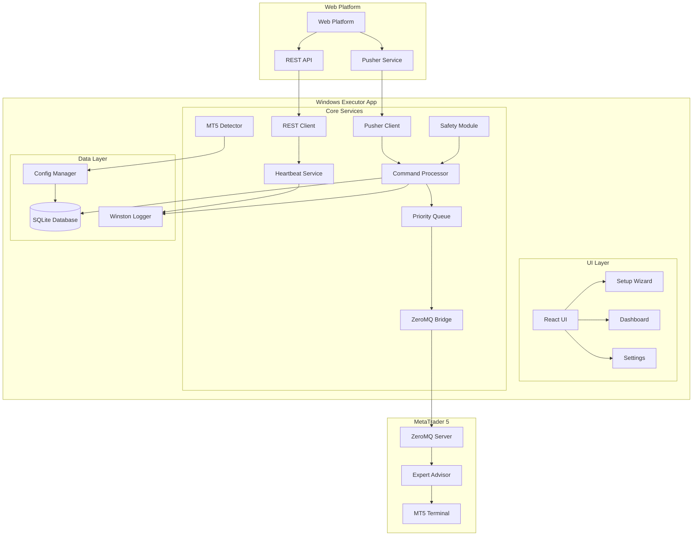
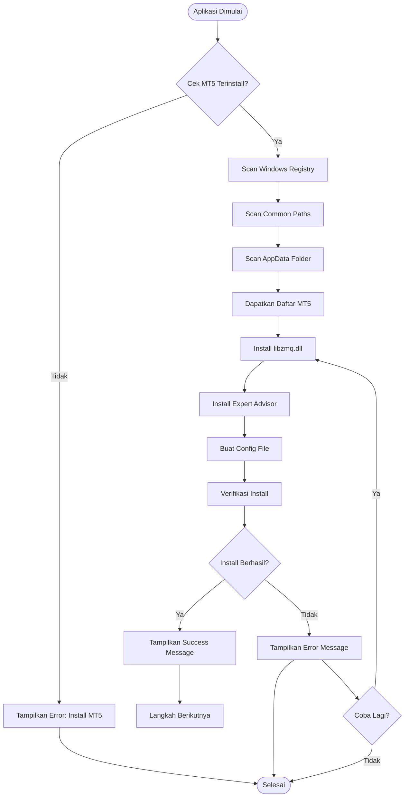
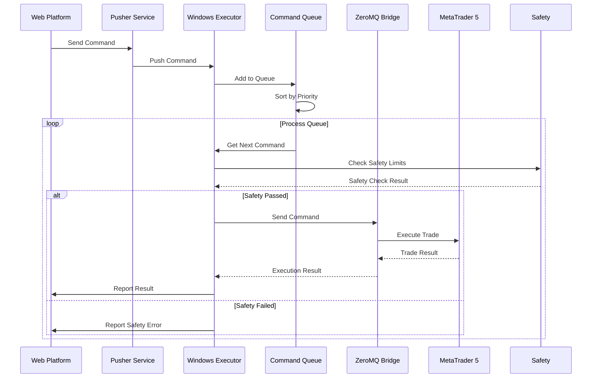
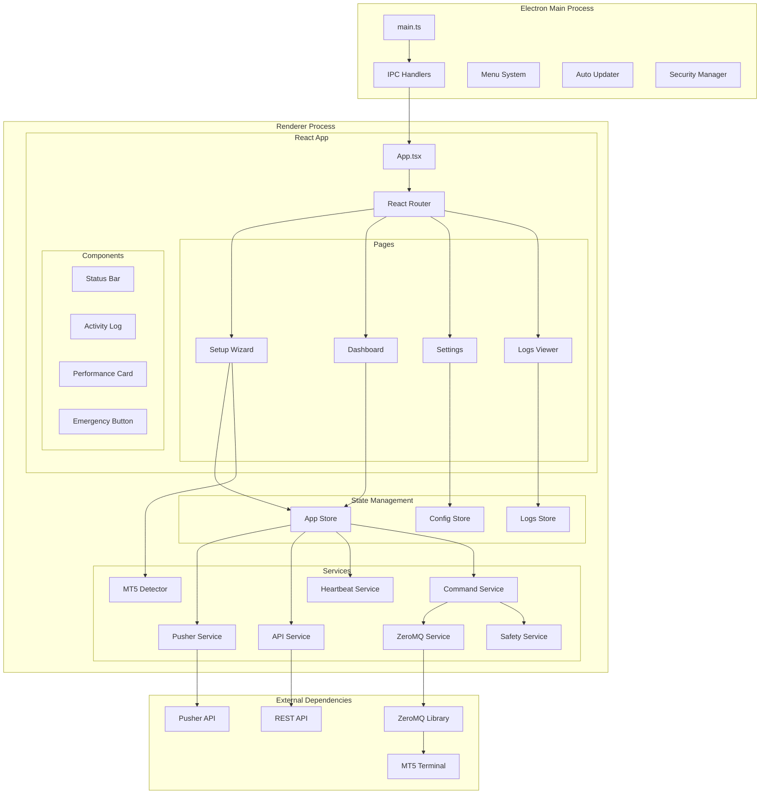
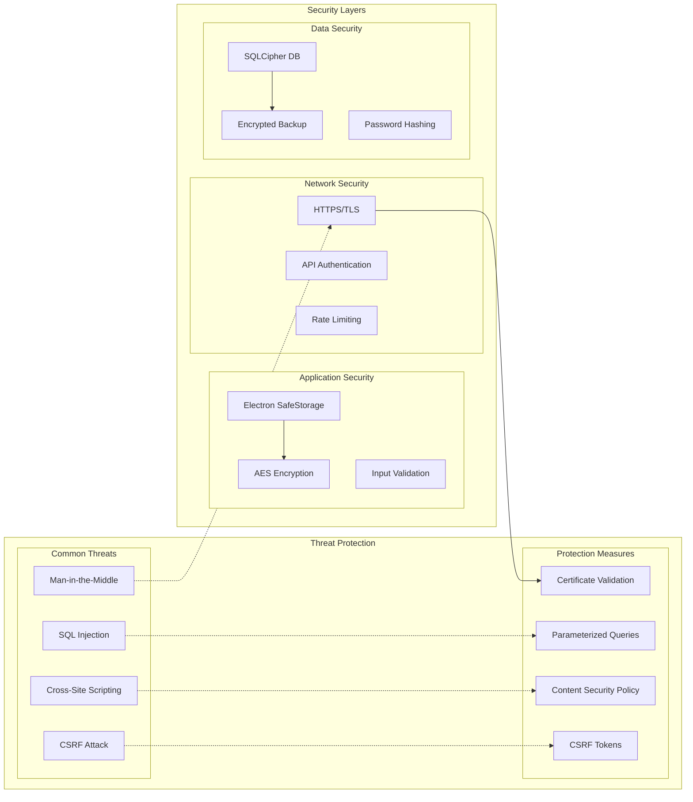
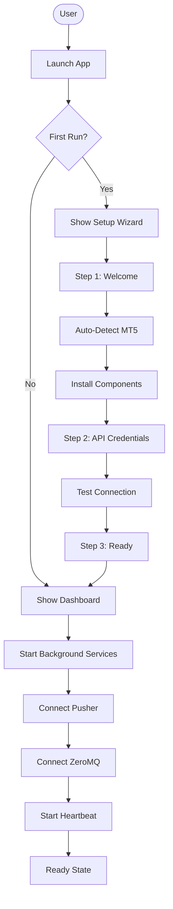
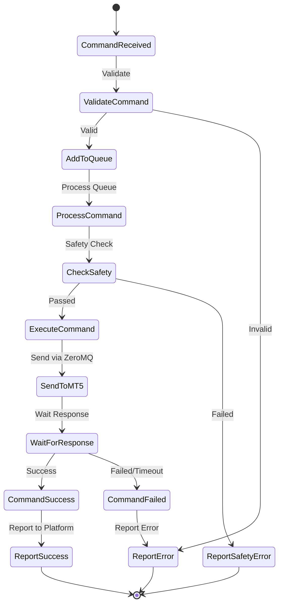
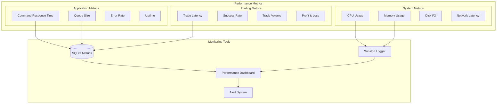
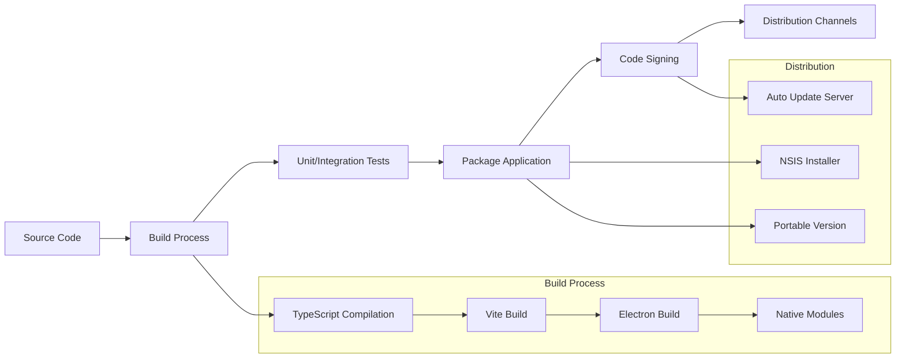

# Arsitektur Windows Executor Platform

## 🏗️ Diagram Arsitektur Sistem

### High-Level Architecture

### Auto-Installation Flow

### Command Processing Flow

### Database Schema Relations

```mermaid
erDiagram
    CONFIG {
        int id PK
        string key UK
        text value
        boolean encrypted
        datetime created_at
        datetime updated_at
    }
    
    MT5_INSTALLATIONS {
        int id PK
        string path
        string data_path
        string version
        int build
        string library_path
        string experts_path
        boolean is_running
        string broker
        string account_number
        boolean is_active
        datetime created_at
        datetime updated_at
    }
    
    COMMAND_QUEUE {
        int id PK
        string command_id UK
        string command_type
        string priority
        string status
        text parameters
        datetime received_at
        datetime executed_at
        text result
        text error_message
        int retry_count
    }
    
    COMMAND_HISTORY {
        int id PK
        string command_id
        string command_type
        string status
        datetime received_at
        datetime executed_at
        datetime completed_at
        text result
        text error_message
        int execution_time_ms
    }
    
    TRADES {
        int id PK
        int ticket UK
        string symbol
        string type
        decimal volume
        decimal open_price
        decimal close_price
        datetime open_time
        datetime close_time
        decimal profit
        decimal commission
        decimal swap
        string comment
        int magic_number
        string status
    }
    
    ACTIVITY_LOGS {
        int id PK
        datetime timestamp
        string level
        string category
        text message
        text metadata
    }
    
    PERFORMANCE_METRICS {
        int id PK
        date date
        int total_trades
        int winning_trades
        int losing_trades
        decimal total_profit
        decimal total_loss
        decimal net_profit
        decimal win_rate
        decimal profit_factor
        decimal max_drawdown
        decimal sharpe_ratio
        datetime created_at
    }
    
    SAFETY_LIMITS {
        int id PK
        string name UK
        decimal value
        boolean is_enabled
        text description
        datetime created_at
        datetime updated_at
    }
    
    HEARTBEAT_LOGS {
        int id PK
        datetime timestamp
        string status
        int response_time_ms
        text metadata
    }
```

### Component Architecture

### Security Architecture

## 🔄 Data Flow Diagram

### Setup Flow

### Trading Command Flow

## 📊 Performance Monitoring

### Metrics Collection

## 🚀 Deployment Architecture

### Build Process

## 📝 Kesimpulan

Diagram arsitektur ini memberikan visualisasi lengkap dari sistem Windows Executor Platform, mencakup:

1. **High-Level Architecture** - Hubungan antar komponen utama
2. **Auto-Installation Flow** - Proses otomatisasi instalasi MT5
3. **Command Processing** - Alur eksekusi perintah trading
4. **Database Relations** - Struktur database dan relasinya
5. **Component Architecture** - Struktur komponen aplikasi
6. **Security Architecture** - Lapisan keamanan sistem
7. **Data Flow** - Alur data dalam aplikasi
8. **Performance Monitoring** - Sistem monitoring performa
9. **Deployment Architecture** - Proses build dan distribusi

Dengan arsitektur yang well-designed ini, aplikasi akan memiliki:
- **Scalability** - Mudah dikembangkan
- **Maintainability** - Mudah dirawat
- **Security** - Aman dari berbagai ancaman
- **Performance** - Performa tinggi dan optimal
- **Reliability** - Handal dan stabil