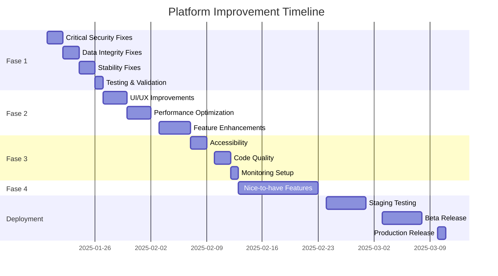

# 📋 RENCANA PERBAIKAN PLATFORM FX
**Tanggal:** 17 Januari 2025  
**Berdasarkan:** Hasil QA Audit Report  
**Timeline Target:** 4-6 Minggu  
**Status:** Draft v1.0

---

## 📊 RINGKASAN EKSEKUTIF

### Situasi Saat Ini
- **Total Issues:** 47 (8 Kritis, 15 Tinggi, 16 Sedang, 8 Rendah)
- **Status Platform:** NOT PRODUCTION READY
- **Estimasi Perbaikan:** 4-6 minggu dengan 2-3 developers
- **Risk Level:** HIGH jika deploy tanpa perbaikan

### Target Outcomes
- Zero critical bugs
- 90%+ test coverage
- < 3s page load time
- < 0.1% error rate
- Production-ready platform

---

## 🎯 PRIORITAS PERBAIKAN

### FASE 1: CRITICAL HOTFIX (Minggu 1)
**Timeline:** 5 hari kerja  
**Resources:** 2 Senior Developers  
**Focus:** Security & Data Integrity

#### 1.1 Security Fixes (Hari 1-2)
- [ ] **BUG-003:** Implementasi authentication check di strategy detail
- [ ] **BUG-006:** Sanitasi input untuk prevent SQL injection
- [ ] **BUG-007:** Implementasi rate limiting pada semua API endpoints
- [ ] **BUG-008:** Secure API key storage mechanism

**Implementation Details:**
```typescript
// Rate limiting configuration
const rateLimitConfig = {
  windowMs: 60 * 1000, // 1 minute
  max: {
    GET: 100,    // 100 GET requests per minute
    POST: 10,    // 10 POST requests per minute
    PUT: 10,     // 10 PUT requests per minute
    DELETE: 5    // 5 DELETE requests per minute
  }
};

// Apply to all routes
app.use('/api/*', rateLimit(rateLimitConfig));
```

#### 1.2 Data Integrity Fixes (Hari 2-3)
- [ ] **BUG-001:** Fix pip conversion logic untuk berbagai symbols
- [ ] **BUG-004:** Validasi date range di frontend dan backend
- [ ] **BUG-015:** Fix win rate calculation untuk open trades

**Symbol Configuration:**
```javascript
const SYMBOL_CONFIG = {
  'EURUSD': { pipMultiplier: 0.0001, minPips: 20, maxPips: 50 },
  'USDJPY': { pipMultiplier: 0.01, minPips: 20, maxPips: 50 },
  'XAUUSD': { pipMultiplier: 0.1, minPips: 30, maxPips: 100 },
  'BTCUSD': { pipMultiplier: 1, minPips: 100, maxPips: 500 },
  'US30': { pipMultiplier: 1, minPips: 50, maxPips: 200 }
};
```

#### 1.3 Stability Fixes (Hari 3-4)
- [ ] **BUG-002:** Fix race condition pada backtest submission
- [ ] **BUG-005:** Fix memory leak pada polling mechanism
- [ ] **BUG-012:** Implementasi Error Boundary components

#### 1.4 Testing & Validation (Hari 5)
- [ ] Run full regression test suite
- [ ] Security penetration testing
- [ ] Performance baseline measurement
- [ ] User acceptance testing (UAT) dengan internal team

**Success Criteria:**
- All critical bugs resolved
- Zero security vulnerabilities
- No memory leaks detected
- All tests passing

---

### FASE 2: HIGH PRIORITY IMPROVEMENTS (Minggu 2-3)
**Timeline:** 10 hari kerja  
**Resources:** 2 Developers + 1 QA  
**Focus:** UX & Performance

#### 2.1 UI/UX Improvements (Hari 6-8)
- [ ] **BUG-009:** Real-time status updates implementation
- [ ] **BUG-010:** Add loading states ke semua components
- [ ] **BUG-013:** Improve error messages untuk user clarity
- [ ] **BUG-014:** Custom confirmation dialogs
- [ ] **BUG-020:** Responsive design fixes

**Component Library Updates:**
```typescript
// Reusable loading component
export const LoadingState = ({ 
  type = 'spinner', 
  message = 'Loading...' 
}) => {
  return (
    <div className="flex items-center justify-center p-8">
      {type === 'skeleton' ? <Skeleton /> : <Spinner />}
      {message && <span className="ml-3">{message}</span>}
    </div>
  );
};

// Standardized error display
export const ErrorMessage = ({ 
  error, 
  retry 
}: { 
  error: Error; 
  retry?: () => void 
}) => {
  const userMessage = getUserFriendlyMessage(error);
  return (
    <Alert variant="error">
      <AlertTitle>{userMessage.title}</AlertTitle>
      <AlertDescription>{userMessage.description}</AlertDescription>
      {retry && (
        <Button onClick={retry} className="mt-2">
          Try Again
        </Button>
      )}
    </Alert>
  );
};
```

#### 2.2 Performance Optimization (Hari 9-11)
- [ ] **BUG-011:** Implementasi pagination untuk strategy list
- [ ] **BUG-022:** Add caching strategy dengan Redis/Memory cache
- [ ] **BUG-039:** Optimize database queries dengan indexes
- [ ] **BUG-021:** Enforce concurrent backtest limits

**Database Optimization:**
```sql
-- Add indexes for frequently queried fields
CREATE INDEX idx_strategies_user_deleted ON strategies(userId, deletedAt);
CREATE INDEX idx_backtests_strategy_status ON backtests(strategyId, status);
CREATE INDEX idx_backtests_created ON backtests(createdAt DESC);

-- Optimize query for strategy list with pagination
SELECT s.*, 
       COUNT(DISTINCT b.id) as backtest_count,
       COUNT(DISTINCT t.id) as trade_count
FROM strategies s
LEFT JOIN backtests b ON s.id = b.strategyId
LEFT JOIN trades t ON s.id = t.strategyId
WHERE s.userId = $1 AND s.deletedAt IS NULL
GROUP BY s.id
ORDER BY s.createdAt DESC
LIMIT $2 OFFSET $3;
```

#### 2.3 Feature Enhancements (Hari 12-15)
- [ ] **BUG-016:** Timezone handling implementation
- [ ] **BUG-017:** Export functionality for backtest results
- [ ] **BUG-018:** AI strategy generator validation
- [ ] **BUG-019:** Version control for strategy updates
- [ ] **BUG-023:** WebSocket implementation for real-time updates

**WebSocket Architecture:**
```typescript
// Server-side WebSocket setup
import { Server } from 'socket.io';

const io = new Server(server, {
  cors: { origin: process.env.CLIENT_URL },
  transports: ['websocket', 'polling']
});

io.on('connection', (socket) => {
  socket.on('subscribe:backtest', (backtestId) => {
    socket.join(`backtest:${backtestId}`);
  });
  
  // Emit updates when backtest status changes
  emitBacktestUpdate(backtestId, status) {
    io.to(`backtest:${backtestId}`).emit('backtest:update', {
      id: backtestId,
      status,
      timestamp: new Date()
    });
  }
});
```

---

### FASE 3: MEDIUM PRIORITY & POLISH (Minggu 4)
**Timeline:** 5 hari kerja  
**Resources:** 1 Developer + 1 QA  
**Focus:** Quality & Polish

#### 3.1 Accessibility & Usability (Hari 16-17)
- [ ] **BUG-025:** Keyboard navigation support
- [ ] **BUG-026:** ARIA labels implementation
- [ ] **BUG-029:** Tooltips untuk technical terms
- [ ] **BUG-028:** Search & filter functionality

#### 3.2 Code Quality & Testing (Hari 18-19)
- [ ] **BUG-036:** Unit tests untuk critical functions (target 80% coverage)
- [ ] **BUG-037:** API documentation dengan Swagger/OpenAPI
- [ ] **BUG-035:** Refactor hardcoded values ke configuration

**Test Coverage Requirements:**
```javascript
// Jest configuration for coverage
module.exports = {
  collectCoverageFrom: [
    'src/**/*.{ts,tsx}',
    '!src/**/*.d.ts',
    '!src/**/*.stories.tsx',
    '!src/test/**/*'
  ],
  coverageThreshold: {
    global: {
      branches: 70,
      functions: 70,
      lines: 80,
      statements: 80
    }
  }
};
```

#### 3.3 Monitoring & Observability (Hari 20)
- [ ] **BUG-038:** Setup monitoring system (Sentry/DataDog)
- [ ] Setup alerts untuk critical errors
- [ ] Implement performance monitoring
- [ ] Create operational dashboards

---

### FASE 4: LOW PRIORITY & NICE-TO-HAVE (Minggu 5-6)
**Timeline:** 10 hari kerja (optional)  
**Resources:** 1 Developer  
**Focus:** Enhanced UX

- [ ] **BUG-047:** Dark mode implementation
- [ ] **BUG-045:** Breadcrumb navigation
- [ ] **BUG-046:** Help documentation
- [ ] **BUG-030:** Bulk actions support
- [ ] Advanced filtering & search
- [ ] User preferences persistence
- [ ] Export/Import strategies

---

## 📈 RESOURCE PLANNING

### Team Composition
| Role | Fase 1 | Fase 2 | Fase 3 | Fase 4 |
|------|--------|--------|--------|--------|
| Senior Developer | 2 | 1 | 0 | 0 |
| Mid Developer | 0 | 1 | 1 | 1 |
| QA Engineer | 1 | 1 | 1 | 0 |
| DevOps | 0.5 | 0.5 | 0.5 | 0 |
| **Total FTE** | 3.5 | 3.5 | 2.5 | 1 |

### Budget Estimation
- **Development:** $30,000 - $40,000
- **Infrastructure:** $2,000/month (AWS/Vercel)
- **Tools & Services:** $500/month (Sentry, monitoring)
- **Testing & QA:** $5,000
- **Total:** ~$50,000 for complete implementation

---

## 🔄 IMPLEMENTATION PROCESS

### Daily Workflow
```
09:00 - Daily standup (15 min)
09:15 - Development work
12:00 - Code review & merge
13:00 - Lunch break
14:00 - Development/Testing
16:00 - Integration testing
17:00 - Daily progress report
```

### Code Review Checklist
- [ ] No console.log statements
- [ ] Proper error handling
- [ ] Input validation
- [ ] Security considerations
- [ ] Performance impact
- [ ] Test coverage
- [ ] Documentation updated

### Definition of Done
- [ ] Code complete and reviewed
- [ ] Unit tests written and passing
- [ ] Integration tests passing
- [ ] Documentation updated
- [ ] No critical security issues
- [ ] Performance benchmarks met
- [ ] QA sign-off received

---

## 📊 MONITORING & SUCCESS METRICS

### Key Performance Indicators (KPIs)

#### Technical Metrics
| Metric | Current | Target | Measurement |
|--------|---------|--------|-------------|
| Page Load Time | >5s | <3s | Google Lighthouse |
| API Response (p95) | >1s | <500ms | APM Tool |
| Error Rate | Unknown | <0.1% | Sentry |
| Uptime | Unknown | >99.9% | Monitoring |
| Test Coverage | <50% | >80% | Jest |

#### Business Metrics
| Metric | Target | Measurement |
|--------|--------|-------------|
| User Satisfaction | >4.5/5 | Survey |
| Bug Reports/Week | <5 | Issue Tracker |
| Feature Adoption | >60% | Analytics |
| Time to Resolution | <4 hours | Support System |

### Monitoring Setup
```yaml
# Alerts Configuration
alerts:
  - name: High Error Rate
    condition: error_rate > 1%
    duration: 5 minutes
    severity: critical
    
  - name: Slow API Response
    condition: response_time_p95 > 1000ms
    duration: 10 minutes
    severity: warning
    
  - name: Memory Usage High
    condition: memory_usage > 80%
    duration: 15 minutes
    severity: warning
```

---

## 🚀 DEPLOYMENT STRATEGY

### Pre-Production Checklist
- [ ] All critical and high priority bugs fixed
- [ ] Security audit passed
- [ ] Performance testing completed
- [ ] Load testing passed (1000+ concurrent users)
- [ ] Backup and recovery tested
- [ ] Monitoring configured
- [ ] Documentation complete

### Rollout Plan
1. **Week 1-2:** Development environment
2. **Week 3:** Staging environment with internal testing
3. **Week 4:** Beta release (10% users)
4. **Week 5:** Gradual rollout (25%, 50%, 75%)
5. **Week 6:** Full production release

### Rollback Strategy
- Database snapshots every 6 hours
- Previous version containers ready
- One-click rollback procedure
- Maximum rollback time: 5 minutes

---

## 🔒 RISK MITIGATION

### Identified Risks
| Risk | Probability | Impact | Mitigation |
|------|------------|--------|------------|
| Data loss | Low | High | Regular backups, transaction logs |
| Security breach | Medium | High | Security audit, penetration testing |
| Performance issues | Medium | Medium | Load testing, caching, CDN |
| User adoption | Low | Medium | Training, documentation, support |
| Technical debt | High | Low | Code review, refactoring time |

### Contingency Plans
1. **If critical bug in production:**
   - Immediate rollback
   - Hotfix development
   - Emergency deployment process

2. **If performance degrades:**
   - Enable emergency caching
   - Scale infrastructure
   - Implement rate limiting

3. **If security issue found:**
   - Immediate patch
   - Security audit
   - User notification if needed

---

## 📝 DOCUMENTATION REQUIREMENTS

### Technical Documentation
- [ ] API Documentation (OpenAPI/Swagger)
- [ ] Database Schema Documentation
- [ ] Architecture Diagrams
- [ ] Deployment Guide
- [ ] Troubleshooting Guide

### User Documentation
- [ ] User Manual
- [ ] Video Tutorials
- [ ] FAQ Section
- [ ] API Integration Guide
- [ ] Best Practices Guide

### Developer Documentation
- [ ] Setup Guide
- [ ] Contributing Guidelines
- [ ] Code Style Guide
- [ ] Testing Guide
- [ ] Security Guidelines

---

## ✅ ACCEPTANCE CRITERIA

### Minimum Viable Product (MVP)
- All critical bugs resolved
- Core features working reliably
- Basic security implemented
- Acceptable performance (<5s load time)
- Essential documentation

### Production Ready
- All high priority bugs resolved
- Comprehensive testing (>80% coverage)
- Security hardened
- Performance optimized (<3s load time)
- Complete documentation
- Monitoring & alerts configured
- Backup & recovery tested

### Excellence Standard
- All medium priority issues resolved
- Advanced features implemented
- Outstanding UX/UI
- Comprehensive testing (>90% coverage)
- Real-time features
- Advanced analytics

---

## 📅 TIMELINE SUMMARY



---

## 👥 STAKEHOLDER COMMUNICATION

### Weekly Status Report Template
```markdown
# Week [X] Status Report

## Completed This Week
- [List of completed items]

## In Progress
- [Current work items]

## Blockers
- [Any blocking issues]

## Next Week Plan
- [Planned items]

## Metrics
- Bugs Fixed: X/47
- Test Coverage: X%
- Performance: Xs load time

## Risks & Issues
- [Current risks]
```

### Communication Channels
- **Daily Updates:** Slack #fx-platform-dev
- **Weekly Reports:** Email to stakeholders
- **Urgent Issues:** Direct escalation to PM
- **Documentation:** Confluence/Wiki
- **Code Reviews:** GitHub PRs

---

## 🎯 SUCCESS CRITERIA CHECKLIST

### Technical Excellence
- [ ] Zero critical bugs
- [ ] <5 high priority bugs
- [ ] >80% test coverage
- [ ] <3s page load time
- [ ] <500ms API response time
- [ ] <0.1% error rate
- [ ] Zero security vulnerabilities

### User Experience
- [ ] Intuitive navigation
- [ ] Clear error messages
- [ ] Responsive design
- [ ] Accessibility compliant
- [ ] Consistent UI/UX
- [ ] Helpful documentation

### Operational Readiness
- [ ] Monitoring configured
- [ ] Alerts setup
- [ ] Backup tested
- [ ] Rollback tested
- [ ] Documentation complete
- [ ] Team trained
- [ ] Support process defined

---

## 📞 CONTACT & ESCALATION

### Team Contacts
| Role | Name | Contact | Availability |
|------|------|---------|--------------|
| Project Manager | TBD | email/slack | 09:00-18:00 |
| Tech Lead | TBD | email/slack | 09:00-18:00 |
| QA Lead | TBD | email/slack | 09:00-18:00 |
| DevOps | TBD | email/slack | On-call |

### Escalation Matrix
1. **Level 1:** Development Team Lead
2. **Level 2:** Project Manager
3. **Level 3:** Product Owner
4. **Level 4:** Executive Sponsor

---

**Document Version:** 1.0  
**Created:** 17 Januari 2025  
**Author:** Development Team  
**Next Review:** Weekly during implementation  
**Status:** DRAFT - Pending Approval

---

## APPENDIX A: TECHNICAL DEBT REGISTRY

| Item | Description | Impact | Priority | Effort |
|------|------------|--------|----------|---------|
| TD-001 | Refactor backtest engine | High | Medium | 2 weeks |
| TD-002 | Migrate to TypeScript strict | Medium | Low | 1 week |
| TD-003 | Update dependencies | Low | Low | 2 days |
| TD-004 | Optimize bundle size | Medium | Medium | 3 days |
| TD-005 | Implement design system | High | Medium | 2 weeks |

## APPENDIX B: DEPENDENCY UPDATES

```json
{
  "critical": {
    "next": "14.x.x",
    "react": "18.x.x",
    "@prisma/client": "5.x.x"
  },
  "security": {
    "jsonwebtoken": "9.x.x",
    "bcryptjs": "2.x.x"
  },
  "monitoring": {
    "@sentry/nextjs": "latest",
    "pino": "latest"
  }
}
```

## APPENDIX C: INFRASTRUCTURE REQUIREMENTS

### Minimum Requirements
- **CPU:** 4 vCPUs
- **RAM:** 8 GB
- **Storage:** 100 GB SSD
- **Network:** 100 Mbps
- **Database:** PostgreSQL 14+
- **Cache:** Redis 6+

### Recommended Setup
- **CPU:** 8 vCPUs
- **RAM:** 16 GB
- **Storage:** 500 GB SSD
- **Network:** 1 Gbps
- **Database:** PostgreSQL 15+ with read replicas
- **Cache:** Redis Cluster
- **CDN:** CloudFlare/Fastly
- **Monitoring:** DataDog/New Relic

---

**END OF DOCUMENT**
