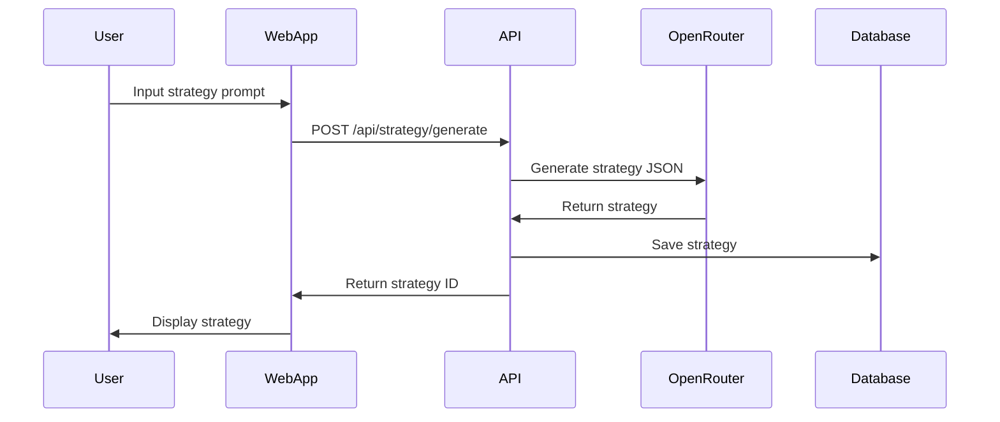
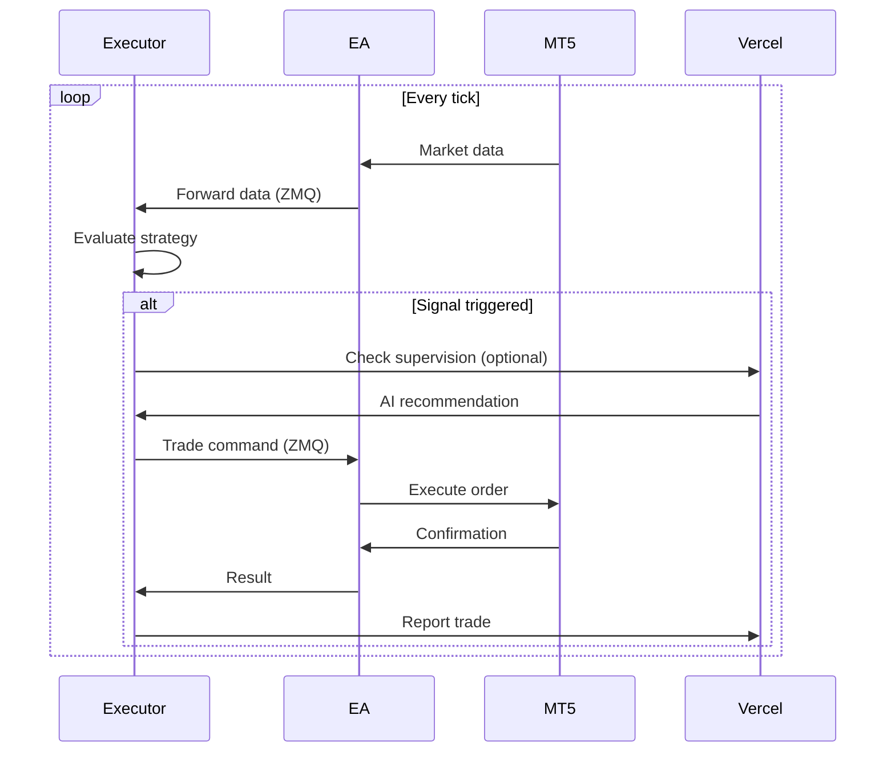
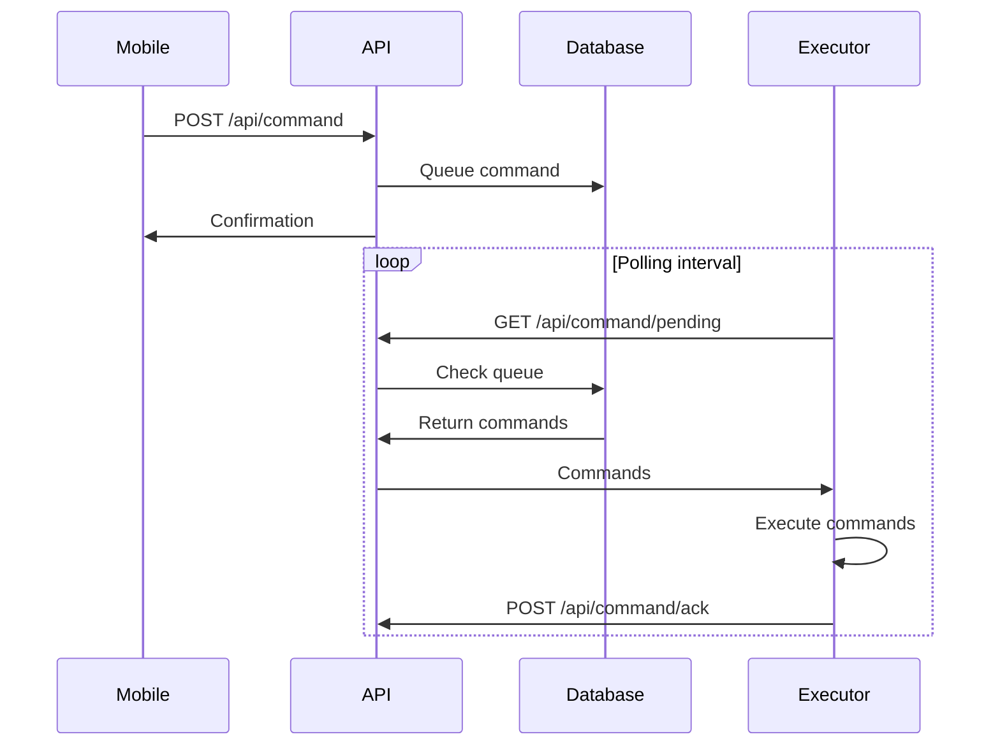

# Arsitektur Sistem NexusTrade

## Overview

NexusTrade menggunakan arsitektur terdistribusi three-tier yang memisahkan concerns antara presentasi, logika bisnis, dan eksekusi trading. Arsitektur ini dirancang untuk mencapai:

- **High Availability**: Redundansi dan failover otomatis
- **Low Latency**: Eksekusi lokal untuk performa maksimal  
- **Scalability**: Horizontal scaling untuk komponen cloud
- **Security**: Multiple layers of security dan enkripsi end-to-end
- **Flexibility**: Modular design untuk easy maintenance

## Komponen Utama

### 1. Supervisor (Cloud Layer)

**Fungsi Utama:**
- Central command & control
- User management & authentication
- Strategy repository & versioning
- AI integration hub
- Analytics & reporting
- Billing & subscription management

**Technology Stack:**
```yaml
Runtime: Node.js 18+ on Vercel Edge
Framework: Next.js 14 with App Router
Database: 
  - Primary: Vercel Postgres (PostgreSQL)
  - Cache: Vercel KV (Redis-compatible)
  - Blob Storage: Vercel Blob (untuk backtest data)
AI Integration: OpenRouter API
Authentication: NextAuth.js with JWT
Payment: Stripe API & Midtrans
```

**Deployment Architecture:**
```
┌─────────────────────────────────────┐
│         Vercel Edge Network         │
├─────────────────────────────────────┤
│   CDN    │  Functions  │  Storage   │
└──────────┴──────┬──────┴────────────┘
                  │
        ┌─────────▼─────────┐
        │   API Gateway     │
        └─────────┬─────────┘
                  │
    ┌─────────────┴─────────────┐
    │                           │
┌───▼────┐              ┌───────▼──────┐
│Database│              │ External APIs │
└────────┘              └──────────────┘
```

### 2. Executor (Edge Layer)

**Fungsi Utama:**
- Local strategy execution
- Real-time market data processing
- Order management
- Risk monitoring
- Performance optimization

**Architecture Design:**
```yaml
Main Application:
  Language: Python 3.9+
  GUI Framework: PyQt6/PySide6
  Communication: ZeroMQ (PyZMQ)
  Data Processing: NumPy, Pandas
  
Expert Advisor:
  Language: MQL5
  Platform: MetaTrader 5
  Communication: ZeroMQ (mql-zmq)
  
Inter-Process Communication:
  Protocol: ZeroMQ REQ/REP pattern
  Encoding: JSON/MessagePack
  Security: Curve25519 encryption
```

**Component Interaction:**
```
┌──────────────────┐     JSON/REST      ┌──────────────────┐
│  Python Client   │◄──────────────────►│  Vercel API      │
└────────┬─────────┘                     └──────────────────┘
         │
         │ ZeroMQ
         │ (localhost:5555)
         │
┌────────▼─────────┐     MT5 API        ┌──────────────────┐
│   MT5 EA (MQL5)  │◄──────────────────►│  Trading Server  │
└──────────────────┘                     └──────────────────┘
```

### 3. Mobile Control (Client Layer)

**Fungsi Utama:**
- Remote monitoring
- Emergency controls
- Performance analytics
- Push notifications
- Multi-account management

**Technology Stack:**
```yaml
Framework: React Native 0.72+
Language: TypeScript
State Management: Redux Toolkit + RTK Query
Navigation: React Navigation 6
UI Components: React Native Elements
Push Notifications: Firebase Cloud Messaging
Charts: React Native Charts Wrapper
```

## Data Flow Architecture

### 1. Strategy Creation Flow


### 2. Trade Execution Flow


### 3. Mobile Intervention Flow


## Security Architecture

### Authentication & Authorization

**Multi-Layer Security:**
1. **User Layer**: Email/password with 2FA optional
2. **API Layer**: JWT tokens with refresh mechanism
3. **Executor Layer**: API keys with HMAC signing
4. **EA Layer**: Local socket with encryption

**Token Management:**
```yaml
Access Token:
  Type: JWT
  Expiry: 15 minutes
  Claims: user_id, subscription_tier, permissions

Refresh Token:
  Type: Opaque token
  Expiry: 30 days
  Storage: HttpOnly cookie

API Key:
  Type: Random 256-bit
  Rotation: Monthly recommended
  Scope: Per-executor instance
```

### Data Encryption

**In Transit:**
- HTTPS/TLS 1.3 for all web traffic
- ZeroMQ Curve25519 for local IPC
- WebSocket Secure (WSS) for real-time

**At Rest:**
- Database: AES-256 encryption
- Sensitive fields: Additional field-level encryption
- Backups: Encrypted with separate keys

### Rate Limiting & DDoS Protection

```yaml
API Rate Limits:
  Public endpoints: 100 req/min
  Authenticated: 1000 req/min
  Strategy generation: 10 req/hour
  Backtesting: 50 req/hour

DDoS Protection:
  Provider: Vercel Shield
  WAF Rules: OWASP Top 10
  Geographic restrictions: Optional
```

## Performance Optimization

### Caching Strategy

**Multi-Level Cache:**
```yaml
CDN Cache:
  Static assets: 1 year
  API responses: 5 minutes (public)

Application Cache:
  User sessions: Redis (Vercel KV)
  Strategy cache: 1 hour
  Market data: 1 minute

Client Cache:
  Strategy rules: Until modified
  Historical data: 24 hours
  UI state: Session storage
```

### Database Optimization

**Query Optimization:**
- Indexed columns: user_id, strategy_id, created_at
- Partitioning: By month for trade history
- Connection pooling: 20 connections default
- Read replicas: For analytics queries

### Network Optimization

**Latency Reduction:**
- Edge functions deployment
- Regional data replication
- WebSocket connection pooling
- Binary protocols (MessagePack) for high-frequency data

## Monitoring & Observability

### Logging Architecture

```yaml
Application Logs:
  Level: INFO (production), DEBUG (development)
  Format: JSON structured logging
  Retention: 30 days

Audit Logs:
  Events: Authentication, trades, configuration changes
  Retention: 1 year
  Compliance: Immutable write-once

Performance Logs:
  Metrics: Response time, throughput, error rate
  Sampling: 10% of requests
  Storage: Time-series database
```

### Monitoring Stack

**Infrastructure:**
- Vercel Analytics: Traffic and performance
- Sentry: Error tracking and alerting
- Custom Dashboard: Trading metrics

**Business Metrics:**
- Active users
- Strategy performance
- Trade volume
- System health score

## Scalability Considerations

### Horizontal Scaling

**Stateless Components:**
- API servers: Auto-scaling based on load
- Worker processes: Queue-based scaling
- WebSocket servers: Sticky sessions with Redis

### Vertical Scaling

**Resource Allocation:**
```yaml
API Servers:
  CPU: 2 vCPU minimum
  Memory: 4GB RAM
  Scaling trigger: 70% utilization

Database:
  Initial: 2 vCPU, 8GB RAM
  Max connections: 100
  Scaling: Manual with downtime

Executor (Client):
  Recommended: 4 cores, 8GB RAM
  Network: 10 Mbps minimum
```

### Load Balancing

**Strategy:**
- Geographic distribution via CDN
- Round-robin for API requests
- Least-connections for WebSocket
- Health checks every 10 seconds

## Disaster Recovery

### Backup Strategy

```yaml
Database Backups:
  Frequency: Daily automated
  Retention: 30 days
  Type: Full + incremental
  Testing: Weekly restore test

Code Repository:
  Primary: GitHub
  Mirror: GitLab
  Backup: S3 bucket

Configuration:
  Version control: Git
  Secrets: Vault with versioning
```

### Recovery Procedures

**RTO & RPO Targets:**
- Recovery Time Objective (RTO): 4 hours
- Recovery Point Objective (RPO): 1 hour
- Automated failover: 5 minutes

**Incident Response:**
1. Detection via monitoring
2. Automatic failover (if configured)
3. Alert on-call engineer
4. Investigate root cause
5. Implement fix
6. Post-mortem analysis

## Compliance & Regulatory

### Data Privacy (GDPR/CCPA)

- Right to deletion implementation
- Data portability API
- Consent management
- Privacy by design

### Financial Regulations

- Trade audit trail
- Risk disclosure
- Best execution monitoring
- Anti-money laundering (AML) checks

## Future Architecture Considerations

### Potential Enhancements

1. **Kubernetes Deployment**: For better orchestration
2. **Event Sourcing**: For complete audit trail
3. **GraphQL API**: For flexible data fetching
4. **Machine Learning Pipeline**: For strategy optimization
5. **Blockchain Integration**: For transparent trade records
6. **Multi-broker Support**: Beyond MT5
7. **Social Trading Features**: Copy trading functionality

### Technology Upgrades

- Migration to Edge computing for lower latency
- WebAssembly for client-side performance
- Quantum-resistant cryptography
- AI model fine-tuning capabilities
