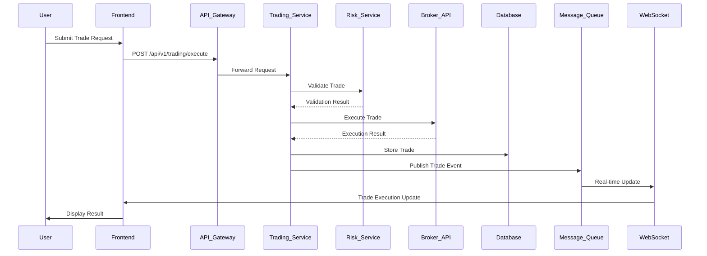
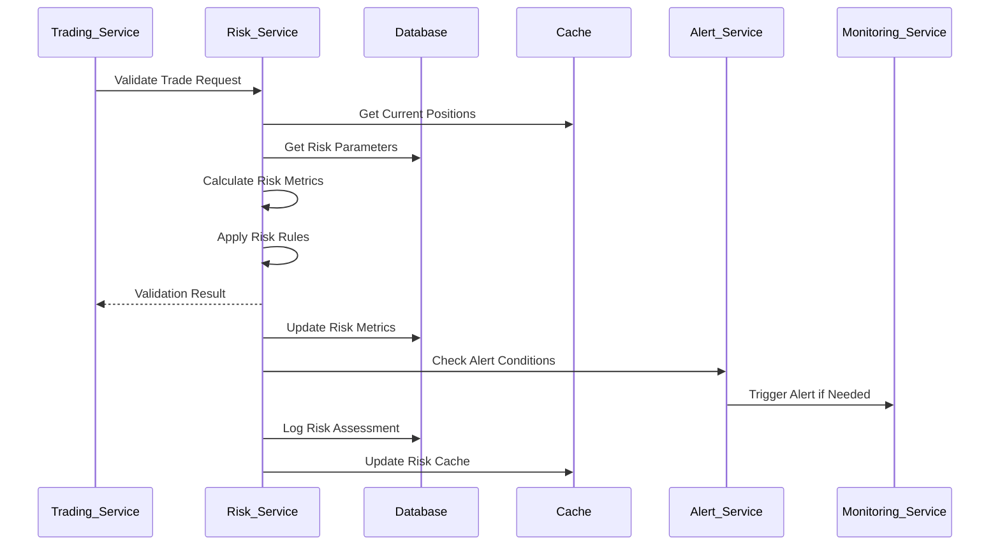
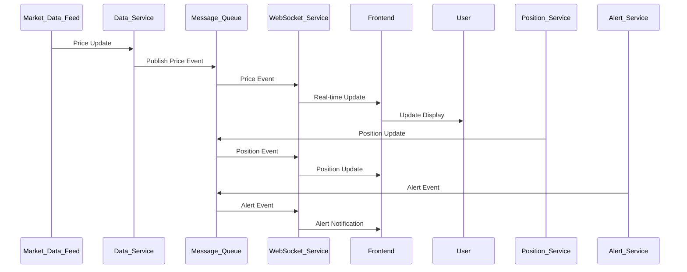
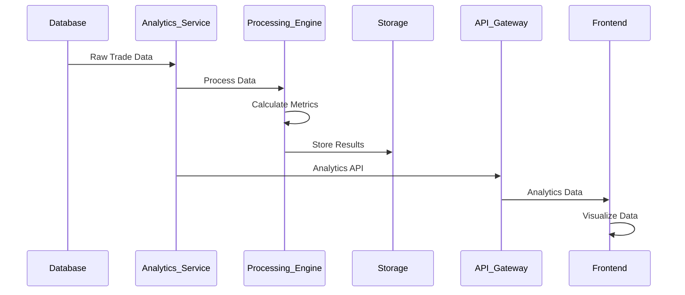

# Data Flow Documentation

## Overview

This document describes the data flow patterns throughout the FX Trading Platform. Understanding data flow is crucial for system design, debugging, and optimization. The platform uses an event-driven architecture with clear data flow patterns to ensure consistency, reliability, and performance.

## Data Flow Principles

### 1. Unidirectional Data Flow
Data flows in a single direction through the system, making it predictable and easier to debug.

### 2. Event-Driven Architecture
Events are the primary mechanism for communication between components, enabling loose coupling and scalability.

### 3. Immutable Data
Data is immutable once created, preventing unintended side effects and enabling easier debugging.

### 4. CQRS (Command Query Responsibility Segregation)
Separate models for read and write operations optimize for different access patterns.

## High-Level Data Flow

```
┌─────────────────────────────────────────────────────────────────┐
│                        User Interface                           │
└─────────────────────┬───────────────────────────────────────────┘
                      │
                      ▼
┌─────────────────────────────────────────────────────────────────┐
│                        API Gateway                              │
└─────────────────────┬───────────────────────────────────────────┘
                      │
                      ▼
┌─────────────────────────────────────────────────────────────────┐
│                      Service Layer                              │
└─────────────────────┬───────────────────────────────────────────┘
                      │
                      ▼
┌─────────────────────────────────────────────────────────────────┐
│                       Data Layer                                │
└─────────────────────┬───────────────────────────────────────────┘
                      │
                      ▼
┌─────────────────────────────────────────────────────────────────┐
│                    External Systems                             │
└─────────────────────────────────────────────────────────────────┘
```

## Core Data Flows

### 1. Trade Execution Data Flow

#### Overview
The trade execution flow handles the complete lifecycle of a trade from request to execution and confirmation.

#### Flow Diagram


#### Detailed Steps

1. **Trade Request**
   - User submits trade request through frontend
   - Request includes symbol, volume, order type, stop loss, take profit
   - Frontend validates basic parameters before sending

2. **API Gateway Processing**
   - Authentication and authorization
   - Rate limiting check
   - Request validation and sanitization
   - Routing to trading service

3. **Risk Validation**
   - Trading service sends trade to risk service
   - Risk service validates against risk parameters
   - Position size calculation and adjustment
   - Portfolio impact assessment

4. **Broker Execution**
   - Validated trade sent to broker API
   - Broker executes trade in market
   - Execution details returned (price, slippage, etc.)
   - Execution status confirmed

5. **Data Persistence**
   - Trade details stored in database
   - Position records updated
   - Audit trail created
   - Analytics data generated

6. **Event Publishing**
   - Trade execution event published to message queue
   - Multiple services consume the event
   - Real-time updates sent via WebSocket
   - Notifications triggered

7. **User Notification**
   - Frontend receives real-time update
   - Trade confirmation displayed to user
   - Portfolio updated in real-time
   - Analytics refreshed

#### Data Transformation
```javascript
// Trade Request Transformation
{
  "symbol": "EURUSD",
  "action": "BUY",
  "volume": 0.1,
  "stopLoss": 1.0800,
  "takeProfit": 1.0900
}
↓
// Risk Validation
{
  "validated": true,
  "adjustedVolume": 0.1,
  "riskAmount": 20.0,
  "riskPercent": 2.0,
  "marginRequired": 100.0
}
↓
// Execution Result
{
  "ticket": 123456,
  "executedPrice": 1.08501,
  "executedVolume": 0.1,
  "slippage": 1,
  "commission": 0.5,
  "status": "FILLED"
}
↓
// Database Record
{
  "tradeId": "trade_123",
  "ticket": 123456,
  "symbol": "EURUSD",
  "action": "BUY",
  "volume": 0.1,
  "openPrice": 1.08501,
  "executedAt": "2024-01-01T00:00:00.000Z"
}
```

### 2. Risk Management Data Flow

#### Overview
The risk management flow continuously monitors and evaluates trading activities to ensure compliance with risk parameters.

#### Flow Diagram


#### Detailed Steps

1. **Risk Validation Request**
   - Trading service requests risk validation
   - Trade parameters provided for assessment
   - User context included for personalization

2. **Data Retrieval**
   - Current positions retrieved from cache
   - Risk parameters fetched from database
   - Market data obtained for calculations

3. **Risk Calculation**
   - Position size calculated based on risk parameters
   - Portfolio impact assessed
   - Correlation analysis performed
   - Risk score calculated

4. **Rule Application**
   - Risk rules applied to trade request
   - Limits checked and enforced
   - Exceptions identified and handled
   - Decision made (approve/reject/adjust)

5. **Metrics Update**
   - Risk metrics updated in database
   - Cache refreshed with latest data
   - Analytics data generated
   - Audit trail created

6. **Alert Processing**
   - Alert conditions evaluated
   - Notifications sent if thresholds exceeded
   - Emergency procedures triggered if needed
   - Monitoring service notified

#### Risk Calculation Flow
```javascript
// Input Data
{
  "tradeRequest": {
    "symbol": "EURUSD",
    "volume": 0.1,
    "stopLoss": 1.0800
  },
  "account": {
    "balance": 10000,
    "equity": 10050,
    "margin": 100
  },
  "positions": [
    {
      "symbol": "GBPUSD",
      "volume": 0.2,
      "unrealizedPnL": 25.0
    }
  ]
}
↓
// Risk Calculations
{
  "riskAmount": 20.0,
  "riskPercent": 2.0,
  "marginRequired": 100.0,
  "correlation": 0.65,
  "exposure": {
    "EUR": 10850,
    "USD": -10850,
    "total": 10850
  }
}
↓
// Risk Decision
{
  "approved": true,
  "adjustedVolume": 0.1,
  "warnings": ["High correlation with GBPUSD"],
  "riskScore": 4.2
}
```

### 3. Real-time Data Flow

#### Overview
Real-time data flow ensures users receive immediate updates on market data, positions, and system events.

#### Flow Diagram


#### Detailed Steps

1. **Data Ingestion**
   - Market data received from external feeds
   - Position updates generated by trading service
   - System events created by various services
   - All data normalized and validated

2. **Event Publishing**
   - Data published to message queue topics
   - Events include all relevant context
   - Timestamps and sequence numbers added
   - Data serialized for efficient transport

3. **Message Processing**
   - WebSocket service subscribes to relevant topics
   - Messages filtered by user permissions
   - Data transformed for client consumption
   - Batching applied for efficiency

4. **Client Distribution**
   - Updates sent to connected clients
   - Subscription filters applied
   - Message acknowledgments tracked
   - Connection health monitored

5. **Frontend Processing**
   - Real-time data received and validated
   - UI components updated efficiently
   - State management synchronized
   - User notifications displayed

#### Real-time Data Structure
```javascript
// Market Data Event
{
  "type": "price_update",
  "symbol": "EURUSD",
  "data": {
    "bid": 1.08500,
    "ask": 1.08501,
    "last": 1.08500,
    "timestamp": "2024-01-01T00:00:00.000Z"
  }
}

// Position Update Event
{
  "type": "position_update",
  "ticket": 123456,
  "data": {
    "currentPrice": 1.08600,
    "unrealizedPnL": 10.0,
    "margin": 100.0,
    "marginLevel": 10050.0
  }
}

// Alert Event
{
  "type": "alert",
  "alertId": "alert_123",
  "data": {
    "type": "RISK_LIMIT",
    "severity": "WARNING",
    "message": "Daily loss approaching limit"
  }
}
```

### 4. Analytics Data Flow

#### Overview
The analytics flow processes historical and real-time data to generate insights, reports, and performance metrics.

#### Flow Diagram


#### Detailed Steps

1. **Data Collection**
   - Raw trade data extracted from database
   - Market data collected from time-series database
   - User activity data aggregated
   - System performance metrics gathered

2. **Data Processing**
   - Data cleaned and normalized
   - Time series data aligned
   - Outliers identified and handled
   - Missing data interpolated

3. **Metric Calculation**
   - Performance metrics calculated
   - Risk metrics computed
   - Portfolio analysis performed
   - Comparative analysis generated

4. **Result Storage**
   - Processed data stored efficiently
   - Indexes created for fast retrieval
   - Aggregates pre-computed
   - Historical data archived

5. **API Delivery**
   - Analytics data exposed via API
   - Queries optimized for performance
   - Caching applied for common requests
   - Pagination for large datasets

#### Analytics Processing Pipeline
```javascript
// Raw Data
{
  "trades": [
    {
      "symbol": "EURUSD",
      "action": "BUY",
      "volume": 0.1,
      "openPrice": 1.08500,
      "closePrice": 1.08600,
      "profit": 10.0,
      "openTime": "2024-01-01T00:00:00.000Z",
      "closeTime": "2024-01-01T01:00:00.000Z"
    }
  ]
}
↓
// Processing
{
  "grouped": {
    "bySymbol": {
      "EURUSD": {
        "trades": 1,
        "totalVolume": 0.1,
        "totalProfit": 10.0
      }
    },
    "byDay": {
      "2024-01-01": {
        "trades": 1,
        "totalProfit": 10.0
      }
    }
  }
}
↓
// Metrics
{
  "performance": {
    "totalTrades": 1,
    "winRate": 100.0,
    "totalProfit": 10.0,
    "averageProfit": 10.0,
    "sharpeRatio": 1.5
  },
  "risk": {
    "maxDrawdown": 0.0,
    "volatility": 0.02,
    "var95": 5.0
  }
}
```

## Data Storage Patterns

### 1. Event Sourcing
All state changes are stored as a sequence of events, providing a complete audit trail and enabling state reconstruction.

### 2. CQRS Pattern
Separate read and write models optimize for different access patterns and improve performance.

### 3. Materialized Views
Pre-computed views of frequently accessed data improve query performance.

### 4. Data Partitioning
Large datasets are partitioned by time, user, or other dimensions for scalability.

## Data Consistency

### 1. Transactional Consistency
ACID transactions ensure data consistency within the relational database.

### 2. Eventual Consistency
The system accepts temporary inconsistencies for improved performance and scalability.

### 3. Compensation Patterns
Compensating transactions handle rollbacks in distributed systems.

### 4. Idempotency
All operations are designed to be idempotent to handle duplicate messages.

## Data Security

### 1. Encryption
All sensitive data is encrypted at rest and in transit.

### 2. Access Control
Fine-grained access controls ensure users only see data they're authorized to access.

### 3. Data Masking
Sensitive data is masked in logs and non-production environments.

### 4. Audit Trail
Complete audit trail of all data access and modifications.

## Performance Optimization

### 1. Caching Strategy
Multi-level caching reduces database load and improves response times.

### 2. Data Compression
Large datasets are compressed to reduce storage and transfer costs.

### 3. Lazy Loading
Data is loaded on-demand to reduce memory usage.

### 4. Batch Processing
Bulk operations improve efficiency for large data volumes.

## Monitoring Data Flow

### 1. Metrics Collection
System and business metrics are collected at multiple points in the data flow.

### 2. Log Analysis
Logs are analyzed to identify bottlenecks and issues in the data flow.

### 3. Tracing
Distributed tracing tracks requests across multiple services.

### 4. Alerting
Automated alerts notify of issues in the data flow pipeline.

---

**Last Updated**: January 2024  
**Version**: 1.0.0