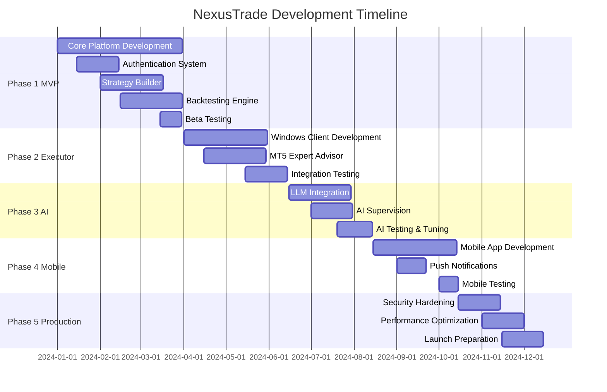

# Development Roadmap - NexusTrade Platform

## Executive Summary

This roadmap outlines the phased development approach for NexusTrade, from MVP to full-scale production platform. Each phase builds upon the previous, ensuring continuous value delivery while maintaining system stability.

## Timeline Overview



## Phase 1: MVP - Core Platform (Q1 2024)

### Objectives
- Establish foundational web platform
- Enable strategy creation and testing
- Implement user management and billing
- Launch beta program

### Deliverables

#### Month 1: Foundation
- [x] Project setup and infrastructure
- [x] Database schema design
- [x] Authentication system
- [x] User registration and profile management
- [x] Basic UI/UX framework

#### Month 2: Strategy Management
- [ ] Visual strategy builder interface
- [ ] Strategy storage and versioning
- [ ] Basic technical indicators library
- [ ] Rule validation engine
- [ ] Strategy sharing mechanism

#### Month 3: Backtesting & Launch
- [ ] Historical data management
- [ ] Backtesting engine core
- [ ] Performance metrics calculation
- [ ] Results visualization
- [ ] Beta launch preparation

### Technical Specifications

```yaml
Infrastructure:
  Hosting: Vercel Edge Network
  Database: Vercel Postgres (Neon)
  Cache: Vercel KV (Upstash)
  CDN: Vercel Edge Cache

Core Features:
  - User authentication (email/password)
  - Strategy CRUD operations
  - Basic backtesting (1-min data)
  - Performance reports
  - Subscription management (Stripe)

Performance Targets:
  - Page load: < 2 seconds
  - API response: < 500ms
  - Backtesting: < 30 seconds for 1 year
  - Concurrent users: 100

Success Metrics:
  - 50 beta users registered
  - 100 strategies created
  - 500 backtests completed
  - System uptime: 99%
```

### Milestones & Validation

| Milestone | Date | Success Criteria |
|-----------|------|-----------------|
| Authentication Complete | Feb 1 | Users can register, login, reset password |
| Strategy Builder Live | Feb 20 | Create strategy with 5+ indicators |
| Backtesting Functional | Mar 10 | Run backtest, view results |
| Beta Launch | Mar 20 | Platform accessible to beta users |

## Phase 2: The Executor (Q2 2024)

### Objectives
- Enable live trading execution
- Develop Windows desktop application
- Create MT5 Expert Advisor
- Establish real-time communication

### Deliverables

#### Month 4: Windows Application
- [ ] PyQt6 application framework
- [ ] API client implementation
- [ ] Local strategy storage
- [ ] Risk management module
- [ ] Auto-update mechanism

#### Month 5: MT5 Integration
- [ ] Expert Advisor development
- [ ] ZeroMQ communication layer
- [ ] Order execution logic
- [ ] Position management
- [ ] Market data streaming

#### Month 6: Integration & Testing
- [ ] End-to-end testing
- [ ] Latency optimization
- [ ] Error handling & recovery
- [ ] Documentation & tutorials
- [ ] Production release

### Technical Specifications

```yaml
Windows Application:
  Language: Python 3.9+
  GUI: PyQt6
  Packaging: PyInstaller
  Size: < 50MB
  
Communication:
  Protocol: ZeroMQ
  Encryption: AES-256
  Heartbeat: 30 seconds
  Reconnection: Automatic
  
Performance Requirements:
  - Startup time: < 5 seconds
  - Memory usage: < 200MB
  - CPU usage: < 10% idle
  - Execution latency: < 100ms
  - Data processing: 1000 ticks/second

Compatibility:
  - Windows 10/11 (64-bit)
  - MT5 Build 3000+
  - .NET Framework 4.8+
```

### Risk Mitigation

| Risk | Impact | Mitigation Strategy |
|------|--------|-------------------|
| MT5 API Changes | High | Version detection, graceful degradation |
| Network Latency | High | Local execution, async operations |
| Windows Security | Medium | Code signing, installer certification |
| Data Corruption | High | Checksums, backup strategies |

## Phase 3: AI Enhancement (Q3 2024)

### Objectives
- Integrate Large Language Models
- Implement AI-powered strategy generation
- Add intelligent trade supervision
- Enhance decision making

### Deliverables

#### Month 7: LLM Integration
- [ ] OpenRouter API integration
- [ ] Prompt engineering framework
- [ ] Strategy JSON generation
- [ ] Natural language processing
- [ ] Multi-model support

#### Month 8: AI Features
- [ ] Strategy generation from text
- [ ] Market condition analysis
- [ ] Risk assessment AI
- [ ] Trade supervision logic
- [ ] Performance prediction

### AI Implementation Details

```typescript
interface AICapabilities {
  strategyGeneration: {
    models: ['gpt-4-turbo', 'claude-3-opus', 'mixtral-8x7b'];
    maxTokens: 4000;
    temperature: 0.3;
    validationLayers: 3;
  };
  
  supervision: {
    checkFrequency: 'per-signal';
    factors: [
      'market_conditions',
      'news_events',
      'correlation_risk',
      'account_state'
    ];
    responseTime: '<2s';
    confidenceThreshold: 0.7;
  };
  
  optimization: {
    method: 'reinforcement_learning';
    episodes: 1000;
    learningRate: 0.001;
    updateFrequency: 'weekly';
  };
}
```

### Success Metrics

- AI strategy success rate: >60%
- Supervision accuracy: >80%
- Response time: <2 seconds
- User satisfaction: >4.5/5

## Phase 4: Mobile Control (Q3-Q4 2024)

### Objectives
- Develop cross-platform mobile app
- Enable remote monitoring and control
- Implement push notifications
- Ensure secure mobile access

### Deliverables

#### Months 8-9: Mobile Development
- [ ] React Native application
- [ ] iOS and Android compatibility
- [ ] Real-time data synchronization
- [ ] Biometric authentication
- [ ] Offline capability

#### Month 10: Features & Polish
- [ ] Push notification system
- [ ] Remote command execution
- [ ] Performance analytics
- [ ] App store preparation
- [ ] Beta testing program

### Mobile Specifications

```yaml
Technical Requirements:
  Framework: React Native 0.72+
  Min iOS Version: 13.0
  Min Android Version: 7.0 (API 24)
  App Size: < 40MB
  
Features:
  - Biometric login (Face ID, fingerprint)
  - Real-time position tracking
  - Emergency stop functionality
  - Performance dashboards
  - Strategy management
  - Push notifications
  
Performance:
  - App launch: < 2 seconds
  - Screen transitions: < 300ms
  - Data sync: < 5 seconds
  - Battery impact: < 5% per hour
  - Offline mode: 24 hours
```

## Phase 5: Production Hardening (Q4 2024 - Q1 2025)

### Objectives
- Ensure platform stability
- Optimize performance
- Strengthen security
- Prepare for scale

### Key Activities

#### Security Hardening
- [ ] Comprehensive security audit
- [ ] Penetration testing
- [ ] DDoS protection setup
- [ ] Data encryption enhancement
- [ ] Compliance certification

#### Performance Optimization
- [ ] Database query optimization
- [ ] Caching strategy implementation
- [ ] CDN configuration
- [ ] Load testing (10,000 users)
- [ ] Auto-scaling setup

#### Operational Excellence
- [ ] Monitoring & alerting system
- [ ] Automated backup procedures
- [ ] Disaster recovery plan
- [ ] Customer support system
- [ ] Documentation completion

### Production Requirements

```yaml
Availability:
  Uptime SLA: 99.9%
  Max downtime: 8.76 hours/year
  Maintenance window: Sunday 2-4 AM UTC
  
Performance:
  Concurrent users: 10,000
  Requests/second: 5,000
  Database connections: 500
  Average response time: <200ms
  
Security:
  SSL/TLS: Required everywhere
  2FA: Available for all users
  Encryption: AES-256 minimum
  Audit logs: 1 year retention
  GDPR: Full compliance
  
Scalability:
  Auto-scaling: Enabled
  Geographic distribution: 3 regions
  Database replication: Multi-region
  Backup frequency: Hourly
  Recovery time: <1 hour
```

## Future Phases (2025+)

### Phase 6: Advanced Features (Q2 2025)
- Social trading capabilities
- Copy trading functionality
- Strategy marketplace
- Educational content platform
- Advanced charting tools

### Phase 7: Institutional Features (Q3 2025)
- Multi-account management
- White-label solution
- API for third-party integration
- Advanced risk analytics
- Compliance reporting

### Phase 8: Global Expansion (Q4 2025)
- Multi-language support (10+ languages)
- Local payment methods
- Regional compliance (MiFID II, etc.)
- Local partnerships
- 24/7 customer support

### Phase 9: Next-Gen Technology (2026)
- Machine learning optimization
- Quantum-resistant cryptography
- Blockchain integration
- Decentralized execution
- AR/VR trading interfaces

## Resource Planning

### Team Composition

```yaml
Phase 1-2 (MVP & Executor):
  - Full-stack developers: 3
  - Backend developer: 1
  - UI/UX designer: 1
  - QA engineer: 1
  - Project manager: 1
  Total: 7 people

Phase 3-4 (AI & Mobile):
  - AI/ML engineer: 2
  - Mobile developers: 2
  - Full-stack developers: 3
  - DevOps engineer: 1
  - QA engineers: 2
  Total: 10 people

Phase 5+ (Production & Scale):
  - Development team: 12
  - DevOps/SRE: 3
  - Security team: 2
  - Customer support: 5
  - Product management: 3
  Total: 25 people
```

### Budget Estimation

| Phase | Duration | Team Cost | Infrastructure | Tools/Services | Marketing | Total |
|-------|----------|-----------|---------------|----------------|-----------|--------|
| Phase 1 | 3 months | $105,000 | $3,000 | $2,000 | $5,000 | $115,000 |
| Phase 2 | 3 months | $105,000 | $5,000 | $3,000 | $10,000 | $123,000 |
| Phase 3 | 2 months | $80,000 | $8,000 | $5,000 | $15,000 | $108,000 |
| Phase 4 | 2 months | $100,000 | $10,000 | $5,000 | $20,000 | $135,000 |
| Phase 5 | 3 months | $225,000 | $15,000 | $10,000 | $50,000 | $300,000 |
| **Total** | **13 months** | **$615,000** | **$41,000** | **$25,000** | **$100,000** | **$781,000** |

## Risk Management

### Technical Risks

| Risk | Probability | Impact | Mitigation |
|------|------------|--------|------------|
| API rate limits | Medium | High | Implement caching, queue system |
| Broker compatibility | Low | High | Multiple broker support |
| Regulatory changes | Medium | High | Legal consultation, flexible architecture |
| Data provider issues | Low | Medium | Multiple data sources |
| Scaling challenges | Medium | Medium | Cloud-native architecture |

### Business Risks

| Risk | Probability | Impact | Mitigation |
|------|------------|--------|------------|
| Competition | High | Medium | Unique features, fast iteration |
| User adoption | Medium | High | Freemium model, marketing |
| Churn rate | Medium | Medium | Engagement features, support |
| Funding shortage | Low | High | Staged development, revenue focus |

## Success Metrics & KPIs

### Phase-wise Success Metrics

```yaml
Phase 1 (MVP):
  - Beta users: 100
  - Strategies created: 500
  - User retention (30-day): 40%
  
Phase 2 (Executor):
  - Live traders: 50
  - Daily trades: 500
  - System uptime: 99.5%
  
Phase 3 (AI):
  - AI strategies: 200
  - Success rate: 65%
  - User satisfaction: 4.2/5
  
Phase 4 (Mobile):
  - App downloads: 1,000
  - Daily active users: 300
  - App rating: 4.5/5
  
Phase 5 (Production):
  - Total users: 5,000
  - Paid subscribers: 1,000
  - Monthly revenue: $100,000
  - Churn rate: <5%
```

### Long-term Goals (Year 1)

- **Users**: 10,000 registered, 2,000 paid
- **Revenue**: $2M ARR
- **Trading Volume**: $100M monthly
- **Strategies**: 10,000 created
- **Uptime**: 99.9%
- **NPS Score**: 50+

## Communication Plan

### Stakeholder Updates
- Weekly: Development team standup
- Bi-weekly: Stakeholder progress report
- Monthly: Investor update
- Quarterly: Board presentation

### User Communication
- Beta users: Weekly newsletter
- Community: Discord/Slack channel
- Blog: Bi-weekly updates
- Changelog: With each release

### Marketing Milestones
- Phase 1: Beta launch announcement
- Phase 2: "Live Trading" campaign
- Phase 3: "AI-Powered" campaign
- Phase 4: Mobile app launch
- Phase 5: Official launch event

## Conclusion

This roadmap provides a structured path from concept to production-ready platform. Key success factors:

1. **Iterative Development**: Each phase delivers value
2. **User Feedback**: Continuous integration of user input
3. **Technical Excellence**: Focus on reliability and performance
4. **Market Fit**: Adapt based on market response
5. **Team Growth**: Scale team with platform needs

Regular reviews and adjustments will ensure the roadmap remains aligned with market opportunities and user needs.
