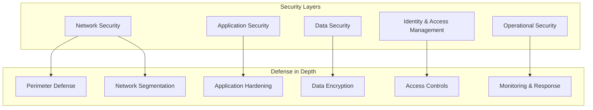

# Security & Compliance Documentation - NexusTrade

## Executive Summary

This document outlines the comprehensive security architecture, compliance requirements, and best practices for the NexusTrade platform. Security is paramount in financial trading systems, and this guide ensures all components meet industry standards.

## Security Architecture Overview



## 1. Network Security

### 1.1 Infrastructure Security

```yaml
CDN & DDoS Protection:
  Provider: Cloudflare Enterprise
  Features:
    - DDoS mitigation
    - WAF (Web Application Firewall)
    - Bot management
    - Rate limiting
    - Geographic restrictions
    
SSL/TLS Configuration:
  Version: TLS 1.3 minimum
  Certificates: EV SSL certificates
  HSTS: Enabled with preload
  Certificate Pinning: Mobile apps
  
Network Segmentation:
  DMZ: Public-facing services
  Application Layer: Internal services
  Data Layer: Database servers
  Management: Admin access only
```

### 1.2 API Security

```typescript
// API Security Middleware
export const securityMiddleware = {
  // Rate limiting per endpoint
  rateLimit: {
    public: rateLimiter({
      windowMs: 60 * 1000, // 1 minute
      max: 100, // requests
      standardHeaders: true,
      legacyHeaders: false,
    }),
    
    authenticated: rateLimiter({
      windowMs: 60 * 1000,
      max: 1000,
      keyGenerator: (req) => req.user?.id || req.ip,
    }),
    
    sensitive: rateLimiter({
      windowMs: 60 * 60 * 1000, // 1 hour
      max: 10,
      skipSuccessfulRequests: false,
    })
  },
  
  // CORS configuration
  cors: {
    origin: process.env.ALLOWED_ORIGINS?.split(','),
    credentials: true,
    methods: ['GET', 'POST', 'PUT', 'DELETE'],
    allowedHeaders: ['Content-Type', 'Authorization', 'X-CSRF-Token'],
    exposedHeaders: ['X-RateLimit-Limit', 'X-RateLimit-Remaining'],
  },
  
  // Security headers
  helmet: {
    contentSecurityPolicy: {
      directives: {
        defaultSrc: ["'self'"],
        scriptSrc: ["'self'", "'unsafe-inline'", 'https://cdn.vercel.com'],
        styleSrc: ["'self'", "'unsafe-inline'"],
        imgSrc: ["'self'", 'data:', 'https:'],
        connectSrc: ["'self'", 'wss://api.nexustrade.com'],
      },
    },
    hsts: {
      maxAge: 31536000,
      includeSubDomains: true,
      preload: true,
    },
  },
};
```

### 1.3 WebSocket Security

```typescript
// WebSocket Authentication & Security
class SecureWebSocketServer {
  constructor() {
    this.wss = new WebSocketServer({
      port: 443,
      perMessageDeflate: false,
      clientTracking: true,
      maxPayload: 100 * 1024, // 100KB max message size
    });
  }
  
  authenticate(ws, req) {
    const token = this.extractToken(req);
    
    if (!token) {
      ws.close(1008, 'Missing authentication');
      return false;
    }
    
    try {
      const decoded = jwt.verify(token, process.env.JWT_SECRET);
      ws.userId = decoded.userId;
      ws.isAuthenticated = true;
      
      // Set connection timeout
      ws.pingInterval = setInterval(() => {
        if (ws.isAlive === false) {
          clearInterval(ws.pingInterval);
          return ws.terminate();
        }
        ws.isAlive = false;
        ws.ping();
      }, 30000);
      
      return true;
    } catch (error) {
      ws.close(1008, 'Invalid authentication');
      return false;
    }
  }
  
  validateMessage(message) {
    // Message validation
    if (message.length > 100 * 1024) {
      throw new Error('Message too large');
    }
    
    // Parse and validate JSON
    const parsed = JSON.parse(message);
    
    // Check message structure
    if (!parsed.type || !parsed.data) {
      throw new Error('Invalid message format');
    }
    
    // Sanitize data
    return this.sanitize(parsed);
  }
}
```

## 2. Application Security

### 2.1 Authentication & Authorization

```typescript
// Multi-factor Authentication Implementation
export class AuthenticationService {
  async login(email: string, password: string, totpCode?: string) {
    // 1. Validate credentials
    const user = await this.validateCredentials(email, password);
    
    // 2. Check account status
    if (user.locked) {
      throw new AccountLockedException();
    }
    
    // 3. Verify 2FA if enabled
    if (user.twoFactorEnabled) {
      if (!totpCode) {
        throw new TwoFactorRequiredException();
      }
      
      const isValid = speakeasy.totp.verify({
        secret: user.twoFactorSecret,
        encoding: 'base32',
        token: totpCode,
        window: 2, // Allow 2 time steps tolerance
      });
      
      if (!isValid) {
        await this.recordFailedLogin(user.id);
        throw new InvalidTwoFactorException();
      }
    }
    
    // 4. Generate secure session
    const sessionId = crypto.randomBytes(32).toString('hex');
    const accessToken = this.generateAccessToken(user);
    const refreshToken = this.generateRefreshToken(user);
    
    // 5. Store session with security metadata
    await this.storeSession({
      sessionId,
      userId: user.id,
      ipAddress: req.ip,
      userAgent: req.headers['user-agent'],
      createdAt: new Date(),
      expiresAt: new Date(Date.now() + 30 * 60 * 1000), // 30 minutes
    });
    
    // 6. Log successful authentication
    await this.auditLog('AUTH_SUCCESS', user.id, {
      ip: req.ip,
      method: '2FA' in totpCode ? '2FA' : 'password',
    });
    
    return {
      accessToken,
      refreshToken,
      sessionId,
    };
  }
  
  async validateSession(sessionId: string, request: Request) {
    const session = await this.getSession(sessionId);
    
    // Check session expiry
    if (session.expiresAt < new Date()) {
      throw new SessionExpiredException();
    }
    
    // Validate session binding
    if (session.ipAddress !== request.ip) {
      // Possible session hijacking
      await this.flagSuspiciousActivity(session.userId, 'IP_MISMATCH');
    }
    
    // Extend session on activity
    await this.extendSession(sessionId);
    
    return session;
  }
}
```

### 2.2 Input Validation & Sanitization

```typescript
// Comprehensive Input Validation
export const validators = {
  // Email validation with DNS check
  email: async (email: string) => {
    const emailRegex = /^[^\s@]+@[^\s@]+\.[^\s@]+$/;
    
    if (!emailRegex.test(email)) {
      throw new ValidationError('Invalid email format');
    }
    
    // Check for disposable email
    if (await isDisposableEmail(email)) {
      throw new ValidationError('Disposable emails not allowed');
    }
    
    // DNS validation
    const domain = email.split('@')[1];
    try {
      await dns.resolveMx(domain);
    } catch {
      throw new ValidationError('Invalid email domain');
    }
    
    return email.toLowerCase().trim();
  },
  
  // Strategy validation
  strategy: (strategy: any) => {
    const schema = z.object({
      name: z.string().min(3).max(100).regex(/^[a-zA-Z0-9\s\-_]+$/),
      symbol: z.enum(ALLOWED_SYMBOLS),
      timeframe: z.enum(['M1', 'M5', 'M15', 'M30', 'H1', 'H4', 'D1']),
      rules: z.object({
        entry: z.object({
          conditions: z.array(z.object({
            indicator: z.enum(ALLOWED_INDICATORS),
            condition: z.enum(['greater_than', 'less_than', 'equals', 'crosses_above', 'crosses_below']),
            value: z.number().min(-1000).max(1000),
          })).max(10),
          logic: z.enum(['AND', 'OR']),
        }),
        exit: z.object({
          takeProfit: z.object({
            type: z.enum(['pips', 'percentage', 'atr']),
            value: z.number().min(1).max(1000),
          }),
          stopLoss: z.object({
            type: z.enum(['pips', 'percentage', 'atr']),
            value: z.number().min(1).max(1000),
          }),
        }),
      }),
    });
    
    return schema.parse(strategy);
  },
  
  // SQL Injection prevention
  sanitizeSQL: (input: string) => {
    // Use parameterized queries instead
    throw new Error('Direct SQL not allowed. Use parameterized queries.');
  },
  
  // XSS prevention
  sanitizeHTML: (input: string) => {
    return DOMPurify.sanitize(input, {
      ALLOWED_TAGS: ['b', 'i', 'u', 'strong', 'em'],
      ALLOWED_ATTR: [],
    });
  },
};
```

### 2.3 CSRF Protection

```typescript
// CSRF Token Management
export class CSRFProtection {
  generateToken(sessionId: string): string {
    const token = crypto.randomBytes(32).toString('hex');
    
    // Store token with session binding
    this.tokenStore.set(`csrf:${sessionId}`, token, {
      ttl: 3600, // 1 hour
    });
    
    return token;
  }
  
  validateToken(sessionId: string, token: string): boolean {
    const storedToken = this.tokenStore.get(`csrf:${sessionId}`);
    
    if (!storedToken || !token) {
      return false;
    }
    
    // Constant-time comparison to prevent timing attacks
    return crypto.timingSafeEqual(
      Buffer.from(storedToken),
      Buffer.from(token)
    );
  }
  
  middleware() {
    return (req: Request, res: Response, next: NextFunction) => {
      // Skip for safe methods
      if (['GET', 'HEAD', 'OPTIONS'].includes(req.method)) {
        return next();
      }
      
      const token = req.headers['x-csrf-token'] || req.body._csrf;
      
      if (!this.validateToken(req.sessionId, token)) {
        return res.status(403).json({
          error: 'Invalid CSRF token',
        });
      }
      
      next();
    };
  }
}
```

## 3. Data Security

### 3.1 Encryption Standards

```yaml
Encryption at Rest:
  Database:
    Algorithm: AES-256-GCM
    Key Management: AWS KMS / Vault
    Key Rotation: Quarterly
    
  File Storage:
    Algorithm: AES-256-CBC
    Per-file Encryption: Yes
    Key Derivation: PBKDF2
    
  Backups:
    Encryption: AES-256
    Key Storage: Separate from data
    Testing: Monthly restore tests

Encryption in Transit:
  External Communication:
    Protocol: TLS 1.3
    Cipher Suites:
      - TLS_AES_256_GCM_SHA384
      - TLS_CHACHA20_POLY1305_SHA256
    
  Internal Communication:
    Service Mesh: mTLS
    Certificate Authority: Internal CA
    Certificate Rotation: Monthly
    
  Client-Executor:
    Protocol: ZeroMQ with CurveZMQ
    Key Exchange: Curve25519
    Encryption: ChaCha20-Poly1305
```

### 3.2 Sensitive Data Handling

```typescript
// Field-level Encryption for PII
export class SensitiveDataHandler {
  private cipher: Cipher;
  
  constructor() {
    this.cipher = new FieldLevelEncryption({
      algorithm: 'aes-256-gcm',
      keyProvider: new KMSKeyProvider(),
    });
  }
  
  async encryptPII(data: UserData): Promise<EncryptedUserData> {
    return {
      id: data.id,
      email: await this.cipher.encrypt(data.email),
      firstName: await this.cipher.encrypt(data.firstName),
      lastName: await this.cipher.encrypt(data.lastName),
      phoneNumber: await this.cipher.encrypt(data.phoneNumber),
      // Non-PII fields remain unencrypted
      createdAt: data.createdAt,
      subscriptionTier: data.subscriptionTier,
    };
  }
  
  async decryptPII(encryptedData: EncryptedUserData): Promise<UserData> {
    // Audit log access to PII
    await this.auditLog('PII_ACCESS', {
      userId: encryptedData.id,
      accessedBy: currentUser.id,
      reason: 'Customer support request',
    });
    
    return {
      id: encryptedData.id,
      email: await this.cipher.decrypt(encryptedData.email),
      firstName: await this.cipher.decrypt(encryptedData.firstName),
      lastName: await this.cipher.decrypt(encryptedData.lastName),
      phoneNumber: await this.cipher.decrypt(encryptedData.phoneNumber),
      createdAt: encryptedData.createdAt,
      subscriptionTier: encryptedData.subscriptionTier,
    };
  }
  
  async hashApiKey(apiKey: string): string {
    return crypto
      .createHash('sha256')
      .update(apiKey)
      .digest('hex');
  }
  
  async tokenize(creditCard: string): string {
    // Use payment provider's tokenization
    return await stripe.tokens.create({
      card: {
        number: creditCard,
      },
    });
  }
}
```

### 3.3 Data Loss Prevention

```typescript
// Automated Backup System
export class BackupManager {
  async performBackup() {
    const timestamp = new Date().toISOString();
    
    // 1. Database backup
    const dbBackup = await this.backupDatabase();
    
    // 2. Encrypt backup
    const encryptedBackup = await this.encryptBackup(dbBackup);
    
    // 3. Store in multiple locations
    await Promise.all([
      this.storeToS3(encryptedBackup, `backup-${timestamp}`),
      this.storeToGlacier(encryptedBackup, `backup-${timestamp}`),
      this.storeToAzure(encryptedBackup, `backup-${timestamp}`),
    ]);
    
    // 4. Verify backup integrity
    const verified = await this.verifyBackup(encryptedBackup);
    
    if (!verified) {
      throw new BackupVerificationError();
    }
    
    // 5. Update backup registry
    await this.updateBackupRegistry({
      timestamp,
      size: encryptedBackup.length,
      checksum: this.calculateChecksum(encryptedBackup),
      locations: ['s3', 'glacier', 'azure'],
    });
    
    // 6. Clean old backups (keep 30 days)
    await this.cleanOldBackups(30);
  }
  
  async restoreFromBackup(backupId: string) {
    // Restoration requires multi-factor approval
    const approved = await this.requestRestoreApproval(backupId);
    
    if (!approved) {
      throw new RestoreNotApprovedException();
    }
    
    // Perform restoration
    const backup = await this.retrieveBackup(backupId);
    const decrypted = await this.decryptBackup(backup);
    await this.restoreDatabase(decrypted);
    
    // Audit log
    await this.auditLog('BACKUP_RESTORE', {
      backupId,
      restoredBy: currentUser.id,
      timestamp: new Date(),
    });
  }
}
```

## 4. Identity & Access Management

### 4.1 Role-Based Access Control (RBAC)

```yaml
Roles:
  SuperAdmin:
    - Full system access
    - User management
    - System configuration
    - Audit log access
    
  Admin:
    - User management
    - Strategy moderation
    - Support ticket handling
    - Report generation
    
  PremiumUser:
    - Unlimited strategies
    - AI features
    - API access
    - Priority support
    
  StandardUser:
    - Limited strategies
    - Basic features
    - Standard support
    
  ReadOnlyUser:
    - View-only access
    - No trading execution
    - No strategy modification

Permissions Matrix:
  Resource: Strategies
    - Create: [StandardUser, PremiumUser, Admin, SuperAdmin]
    - Read: [All]
    - Update: [Owner, Admin, SuperAdmin]
    - Delete: [Owner, Admin, SuperAdmin]
    - Execute: [StandardUser, PremiumUser]
    
  Resource: Trades
    - Execute: [StandardUser, PremiumUser]
    - View: [Owner, Admin, SuperAdmin]
    - Modify: [Owner, Admin, SuperAdmin]
    - Cancel: [Owner, Admin, SuperAdmin]
```

### 4.2 API Key Management

```typescript
// Secure API Key System
export class APIKeyManager {
  async generateAPIKey(userId: string, permissions: string[]) {
    // Generate cryptographically secure key
    const key = crypto.randomBytes(32).toString('base64url');
    const secret = crypto.randomBytes(64).toString('base64url');
    
    // Hash for storage
    const keyHash = await argon2.hash(key);
    const secretHash = await argon2.hash(secret);
    
    // Store with metadata
    await this.db.apiKeys.create({
      userId,
      keyHash,
      secretHash,
      permissions,
      createdAt: new Date(),
      lastUsed: null,
      expiresAt: new Date(Date.now() + 90 * 24 * 60 * 60 * 1000), // 90 days
      ipWhitelist: [],
      rateLimit: this.getRateLimitForUser(userId),
    });
    
    // Return only once (never stored in plaintext)
    return {
      key,
      secret,
      warning: 'Save these credentials securely. They will not be shown again.',
    };
  }
  
  async validateAPIKey(key: string, secret: string, ipAddress: string) {
    const keyHash = await this.findKeyHash(key);
    
    if (!keyHash) {
      throw new InvalidAPIKeyException();
    }
    
    // Verify secret
    const validSecret = await argon2.verify(keyHash.secretHash, secret);
    if (!validSecret) {
      await this.recordFailedAttempt(keyHash.id);
      throw new InvalidAPISecretException();
    }
    
    // Check IP whitelist
    if (keyHash.ipWhitelist.length > 0 && !keyHash.ipWhitelist.includes(ipAddress)) {
      throw new IPNotWhitelistedException();
    }
    
    // Check expiration
    if (keyHash.expiresAt < new Date()) {
      throw new APIKeyExpiredException();
    }
    
    // Update last used
    await this.updateLastUsed(keyHash.id);
    
    return {
      userId: keyHash.userId,
      permissions: keyHash.permissions,
    };
  }
}
```

## 5. Security Monitoring & Incident Response

### 5.1 Security Information and Event Management (SIEM)

```yaml
Monitoring Infrastructure:
  SIEM Platform: Splunk / ELK Stack
  
  Data Sources:
    - Application logs
    - Database logs
    - Network traffic
    - API access logs
    - System metrics
    - User activities
    
  Alert Rules:
    - Multiple failed login attempts (>5 in 5 minutes)
    - Unusual API access patterns
    - Privilege escalation attempts
    - Data exfiltration indicators
    - Geographic anomalies
    - Concurrent session anomalies
    
  Response Automation:
    - Auto-block suspicious IPs
    - Account lockdown on breach detection
    - Alert security team
    - Initiate incident response workflow
```

### 5.2 Audit Logging

```typescript
// Comprehensive Audit Logging
export class AuditLogger {
  private readonly sensitiveActions = [
    'LOGIN',
    'LOGOUT',
    'PASSWORD_CHANGE',
    'PERMISSION_CHANGE',
    'STRATEGY_DELETE',
    'TRADE_EXECUTE',
    'API_KEY_CREATE',
    'DATA_EXPORT',
    'ADMIN_ACTION',
  ];
  
  async log(event: AuditEvent) {
    const entry: AuditLogEntry = {
      id: uuidv4(),
      timestamp: new Date().toISOString(),
      eventType: event.type,
      userId: event.userId,
      ipAddress: event.ipAddress,
      userAgent: event.userAgent,
      resource: event.resource,
      action: event.action,
      result: event.result,
      metadata: this.sanitizeMetadata(event.metadata),
      hash: null,
    };
    
    // Create tamper-proof hash chain
    const previousEntry = await this.getLastEntry();
    entry.hash = this.calculateHash(entry, previousEntry?.hash);
    
    // Store in multiple locations
    await Promise.all([
      this.storeToDatabase(entry),
      this.storeToSIEM(entry),
      this.archiveToS3(entry),
    ]);
    
    // Real-time alerting for sensitive actions
    if (this.sensitiveActions.includes(event.type)) {
      await this.alertSecurityTeam(entry);
    }
  }
  
  private calculateHash(entry: AuditLogEntry, previousHash?: string): string {
    const data = JSON.stringify({
      ...entry,
      previousHash: previousHash || '0',
    });
    
    return crypto
      .createHash('sha256')
      .update(data)
      .digest('hex');
  }
  
  async verifyIntegrity(startDate: Date, endDate: Date): boolean {
    const entries = await this.getEntriesInRange(startDate, endDate);
    let previousHash = '0';
    
    for (const entry of entries) {
      const calculatedHash = this.calculateHash(entry, previousHash);
      
      if (calculatedHash !== entry.hash) {
        // Tampering detected
        await this.alertSecurityTeam({
          type: 'AUDIT_LOG_TAMPERING',
          entry,
          expected: calculatedHash,
          actual: entry.hash,
        });
        
        return false;
      }
      
      previousHash = entry.hash;
    }
    
    return true;
  }
}
```

### 5.3 Incident Response Plan

```yaml
Incident Response Phases:
  1. Detection:
     - Automated monitoring alerts
     - User reports
     - Third-party notifications
     
  2. Analysis:
     - Severity assessment (P1-P4)
     - Impact analysis
     - Root cause identification
     
  3. Containment:
     - Isolate affected systems
     - Prevent lateral movement
     - Preserve evidence
     
  4. Eradication:
     - Remove threat
     - Patch vulnerabilities
     - Update security controls
     
  5. Recovery:
     - Restore services
     - Verify functionality
     - Monitor for recurrence
     
  6. Post-Incident:
     - Document lessons learned
     - Update response procedures
     - Implement improvements

Response Team:
  Security Lead:
    - Incident commander
    - Decision authority
    - External communication
    
  Technical Lead:
    - System isolation
    - Forensic analysis
    - Recovery operations
    
  Development Lead:
    - Code review
    - Patch development
    - Deployment
    
  Legal/Compliance:
    - Regulatory notifications
    - Legal assessment
    - Documentation

Communication Plan:
  Internal:
    - Immediate: Security team, CTO
    - 15 minutes: CEO, Legal
    - 1 hour: All staff
    
  External:
    - 4 hours: Affected users
    - 24 hours: All users (if required)
    - 72 hours: Regulators (GDPR requirement)
```

## 6. Compliance Requirements

### 6.1 GDPR Compliance

```typescript
// GDPR Compliance Implementation
export class GDPRCompliance {
  // Right to Access
  async handleDataRequest(userId: string) {
    const data = await this.collectUserData(userId);
    
    return {
      personalData: data.personal,
      tradingData: data.trading,
      processingActivities: data.processing,
      thirdPartySharing: data.sharing,
      retentionPeriods: data.retention,
    };
  }
  
  // Right to Erasure
  async handleDeletionRequest(userId: string) {
    // Verify identity
    await this.verifyIdentity(userId);
    
    // Check legal obligations
    const canDelete = await this.checkDeletionEligibility(userId);
    
    if (!canDelete.eligible) {
      return {
        success: false,
        reason: canDelete.reason,
        retentionRequired: canDelete.untilDate,
      };
    }
    
    // Perform deletion
    await this.deletePersonalData(userId);
    await this.anonymizeTradingData(userId);
    
    // Notify third parties
    await this.notifyThirdParties(userId);
    
    return {
      success: true,
      deletedAt: new Date(),
      certificate: this.generateDeletionCertificate(userId),
    };
  }
  
  // Consent Management
  async updateConsent(userId: string, consents: ConsentUpdate) {
    await this.db.consents.create({
      userId,
      marketing: consents.marketing,
      analytics: consents.analytics,
      dataSharing: consents.dataSharing,
      timestamp: new Date(),
      ipAddress: req.ip,
      method: 'explicit',
    });
    
    // Apply consent changes
    if (!consents.marketing) {
      await this.unsubscribeFromMarketing(userId);
    }
    
    if (!consents.analytics) {
      await this.excludeFromAnalytics(userId);
    }
  }
}
```

### 6.2 Financial Regulations

```yaml
MiFID II Compliance:
  Best Execution:
    - Monitor execution quality
    - Regular venue assessment
    - Quarterly reporting
    
  Transaction Reporting:
    - Real-time trade reporting
    - Complete audit trail
    - 5-year retention
    
  Client Categorization:
    - Retail clients
    - Professional clients
    - Eligible counterparties

AML/KYC Requirements:
  Customer Due Diligence:
    - Identity verification
    - Address proof
    - Source of funds
    - PEP screening
    
  Transaction Monitoring:
    - Unusual pattern detection
    - Large transaction reporting
    - Suspicious activity reports
    
  Record Keeping:
    - 5-year minimum retention
    - Immutable audit trail
    - Regulatory access
```

## 7. Security Testing & Validation

### 7.1 Penetration Testing

```yaml
Testing Schedule:
  External Penetration Test: Quarterly
  Internal Security Assessment: Monthly
  Code Security Review: Per release
  
Testing Scope:
  Network Layer:
    - Port scanning
    - Service enumeration
    - Vulnerability scanning
    
  Application Layer:
    - OWASP Top 10
    - Authentication bypass
    - Authorization flaws
    - Injection attacks
    - XSS/CSRF
    
  API Security:
    - Endpoint fuzzing
    - Rate limit testing
    - Token manipulation
    
  Mobile Applications:
    - Reverse engineering
    - Certificate pinning bypass
    - Local storage security
```

### 7.2 Security Metrics & KPIs

```yaml
Security Metrics:
  Vulnerability Management:
    - Mean time to detect (MTTD): <24 hours
    - Mean time to patch (MTTP): <72 hours
    - Critical vulnerabilities: 0 tolerance
    
  Incident Response:
    - Incident detection rate: >95%
    - False positive rate: <5%
    - Mean time to respond (MTTR): <1 hour
    
  Access Control:
    - Privileged account usage: <5%
    - MFA adoption: 100%
    - Password policy compliance: 100%
    
  Compliance:
    - Audit findings: <5 per quarter
    - Compliance score: >95%
    - Training completion: 100%
```

## 8. Security Training & Awareness

### 8.1 Developer Security Training

```yaml
Training Program:
  Onboarding:
    - Secure coding practices
    - OWASP guidelines
    - Company security policies
    
  Ongoing Training:
    - Monthly security workshops
    - Quarterly threat briefings
    - Annual certification
    
  Topics:
    - Input validation
    - Authentication/authorization
    - Cryptography basics
    - Security testing
    - Incident response
```

### 8.2 User Security Education

```yaml
User Education:
  Account Security:
    - Strong password requirements
    - 2FA setup guide
    - Phishing awareness
    
  Trading Security:
    - API key best practices
    - Secure connection verification
    - Suspicious activity recognition
    
  Communication:
    - Security newsletters
    - In-app security tips
    - Incident notifications
```

## Conclusion

Security is not a one-time implementation but an ongoing process. This comprehensive security framework ensures:

1. **Defense in Depth**: Multiple layers of security controls
2. **Continuous Monitoring**: Real-time threat detection and response
3. **Compliance**: Meeting regulatory requirements
4. **User Trust**: Protecting user data and funds
5. **Business Continuity**: Minimizing security incidents and their impact

Regular reviews and updates of these security measures ensure the platform remains protected against evolving threats.
