# User Workflows - NexusTrade Platform

## Overview

Dokumen ini menjelaskan alur kerja pengguna end-to-end di platform NexusTrade, dari registrasi hingga eksekusi trading otomatis.

## 1. User Onboarding Workflow

### 1.1 Registration Flow

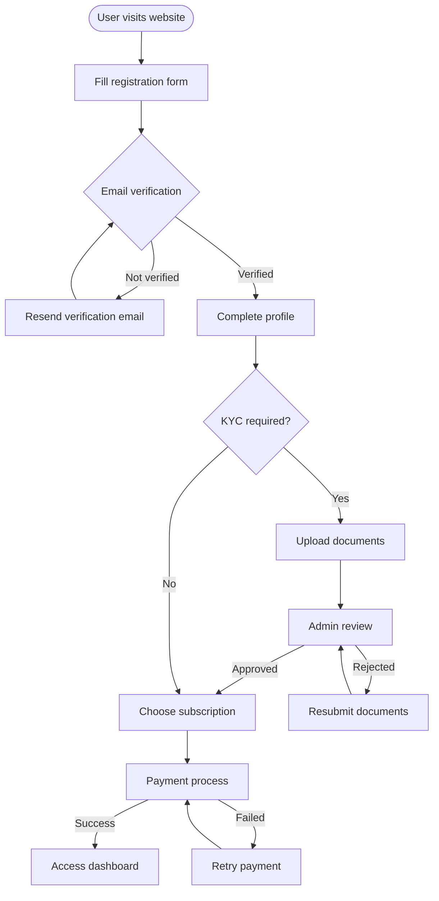

**Implementation Details:**

1. **Registration Form Validation**
   - Email format validation
   - Password strength check (min 8 chars, uppercase, lowercase, number, special char)
   - Phone number format validation
   - Duplicate email check

2. **Email Verification Process**
   - Send verification link with 24-hour expiry
   - Allow resend after 60 seconds
   - Auto-login after verification

3. **KYC Process (if required)**
   - Document types: ID card, passport, driver's license
   - Proof of address: Utility bill, bank statement
   - Selfie with ID for verification
   - Automated OCR scanning
   - Manual review queue for admin

4. **Subscription Selection**
   - Show feature comparison table
   - Calculate pro-rated billing
   - Apply referral/promo codes
   - Show local currency pricing

### 1.2 First-Time Setup Flow

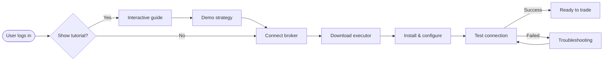

## 2. Strategy Creation Workflows

### 2.1 Manual Strategy Builder

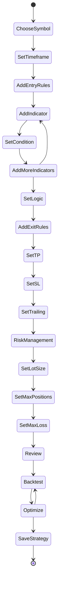

**Step-by-Step Process:**

1. **Symbol & Timeframe Selection**
   ```typescript
   interface StrategyBasics {
     name: string;
     description: string;
     symbol: 'EURUSD' | 'GBPUSD' | 'XAUUSD' | etc;
     timeframe: 'M1' | 'M5' | 'M15' | 'M30' | 'H1' | 'H4' | 'D1';
   }
   ```

2. **Entry Rules Configuration**
   - Add technical indicators
   - Set comparison conditions
   - Define logical operators (AND/OR)
   - Preview signal generation

3. **Exit Rules Setup**
   - Take Profit: Fixed pips, ATR multiple, or percentage
   - Stop Loss: Fixed pips, ATR multiple, or percentage  
   - Trailing Stop: Enable/disable, distance configuration
   - Time-based exits: Max holding period

4. **Risk Management**
   - Position sizing method
   - Maximum simultaneous positions
   - Daily/weekly loss limits
   - Margin requirements check

### 2.2 AI-Powered Strategy Generation

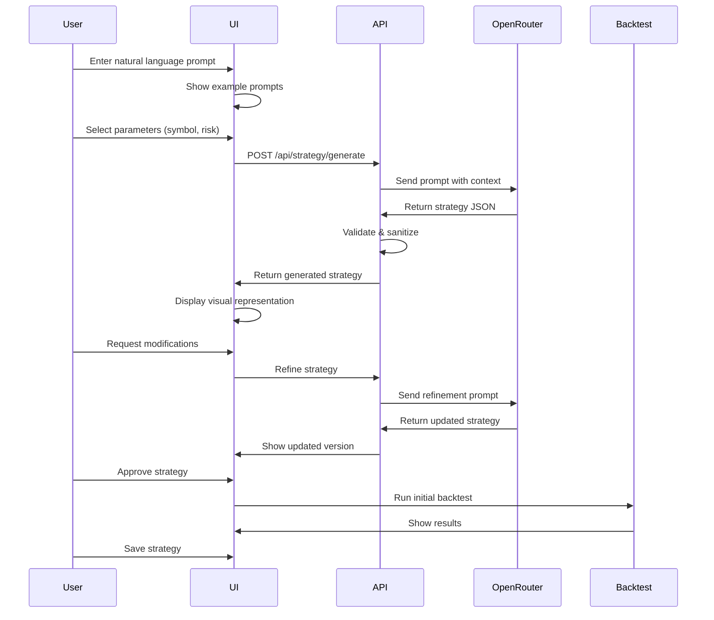

**AI Prompt Examples:**

1. **Trend Following**
   ```
   "Create a trend-following strategy for EURUSD on H1 timeframe. 
   Enter long when price crosses above 50 EMA and RSI is above 50. 
   Use 2:1 risk-reward ratio with 30 pip stop loss."
   ```

2. **Mean Reversion**
   ```
   "Build a mean reversion strategy for GBPUSD. Buy when RSI drops 
   below 20 and price touches lower Bollinger Band. Sell when price 
   reaches middle band. Maximum 3 positions open simultaneously."
   ```

3. **Breakout Strategy**
   ```
   "Design a breakout strategy that enters trades when price breaks 
   above the previous day's high with above-average volume. Set stop 
   loss at the previous day's low."
   ```

### 2.3 Strategy Import

```yaml
Supported Formats:
  - TradingView Pine Script
  - MetaTrader 4/5 EA (basic)
  - JSON strategy format
  - CSV with trade rules
  
Import Process:
  1. Upload file
  2. Parse and validate
  3. Convert to internal format
  4. Show conversion summary
  5. Allow manual adjustments
  6. Save as new strategy
```

## 3. Backtesting Workflow

### 3.1 Standard Backtest

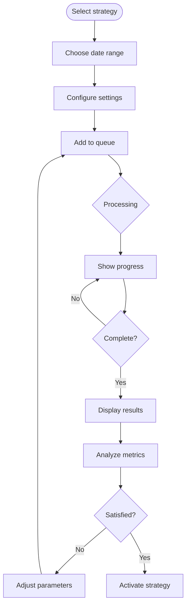

**Backtest Configuration:**

```typescript
interface BacktestConfig {
  strategy: string;
  dateRange: {
    from: Date;
    to: Date;
  };
  marketConditions: {
    spread: number;        // in pips
    commission: number;    // per lot
    slippage: number;     // in pips
    swapRates: boolean;   // include swap
  };
  moneyManagement: {
    initialBalance: number;
    compounding: boolean;
    riskPerTrade: number; // percentage
  };
  dataQuality: 'tick' | '1min' | '5min';
}
```

### 3.2 Walk-Forward Analysis

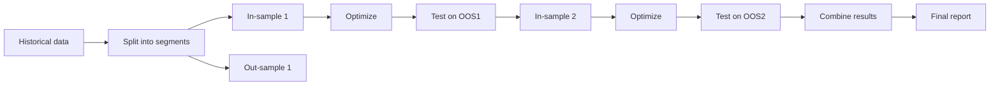

### 3.3 Monte Carlo Simulation

```yaml
Process:
  1. Run base backtest
  2. Generate random variations:
     - Trade order shuffling
     - Random skipping of trades
     - Spread/slippage variations
     - Starting point variations
  3. Run 1000+ iterations
  4. Calculate statistics:
     - Confidence intervals
     - Probability of ruin
     - Expected drawdown
  5. Display distribution charts
```

## 4. Live Trading Workflow

### 4.1 Strategy Activation

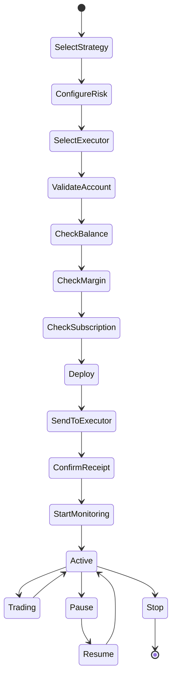

### 4.2 Trade Execution Flow

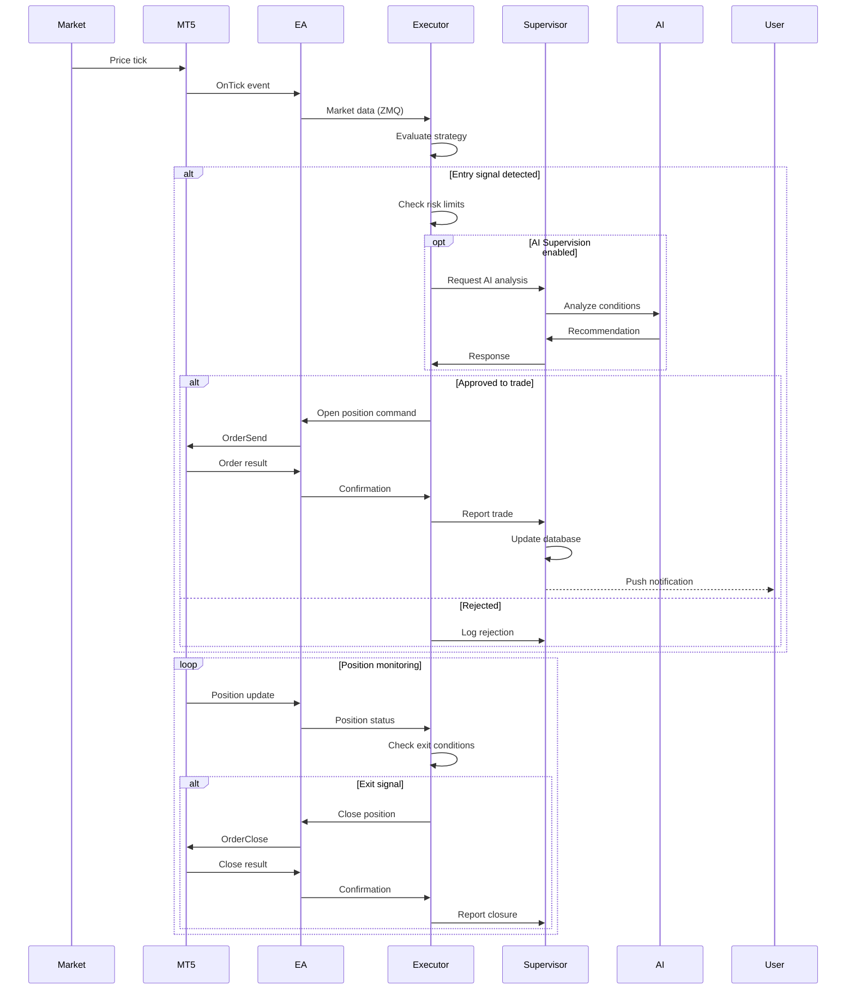

### 4.3 Risk Management Flow

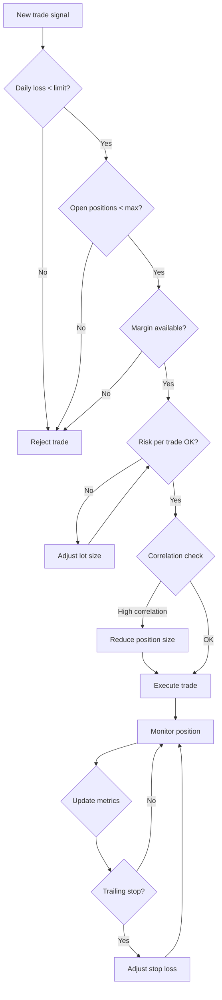

## 5. Mobile Control Workflow

### 5.1 Remote Monitoring

```yaml
Real-time Updates:
  - Position status (P&L, pips)
  - Account metrics (balance, equity, margin)
  - Strategy performance
  - Executor health status
  
Push Notifications:
  Triggers:
    - New position opened
    - Position closed
    - Daily profit/loss threshold
    - Margin call warning
    - Strategy error
    - Connection lost
    
  Customization:
    - Enable/disable per event type
    - Quiet hours setting
    - Importance levels
    - Sound/vibration settings
```

### 5.2 Emergency Intervention

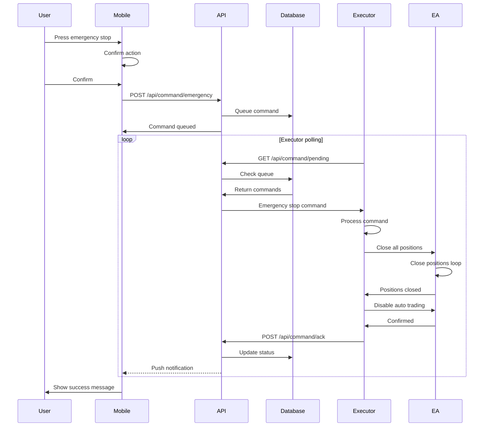

## 6. Analytics & Reporting Workflow

### 6.1 Performance Dashboard

```yaml
Dashboard Sections:
  1. Account Overview:
     - Current balance
     - Today's P&L
     - Open positions
     - Active strategies
     
  2. Performance Metrics:
     - Win rate
     - Profit factor  
     - Sharpe ratio
     - Maximum drawdown
     
  3. Charts:
     - Equity curve
     - Monthly returns
     - Win/loss distribution
     - Strategy comparison
     
  4. Recent Activity:
     - Last 10 trades
     - Recent signals
     - System events
```

### 6.2 Report Generation

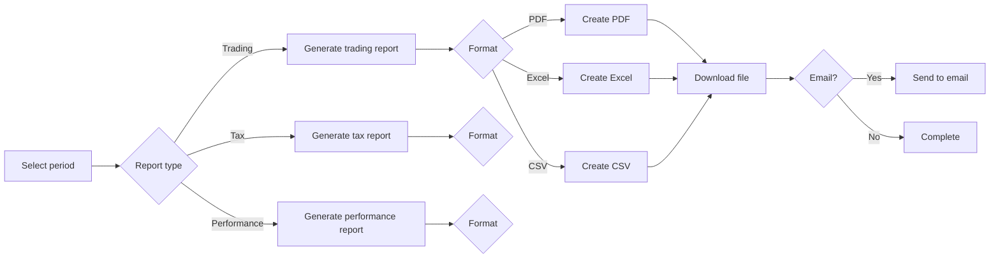

## 7. Troubleshooting Workflow

### 7.1 Connection Issues

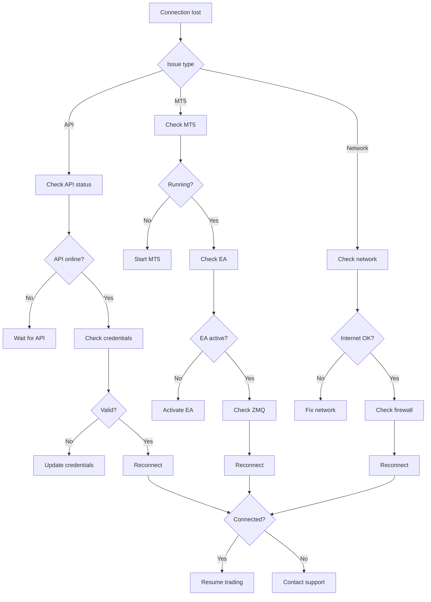

### 7.2 Strategy Debugging

```yaml
Debug Steps:
  1. Check strategy status:
     - Is it active?
     - Any error messages?
     - Last execution time
     
  2. Verify market conditions:
     - Is market open?
     - Spread within limits?
     - Sufficient liquidity?
     
  3. Review entry conditions:
     - Indicator values
     - Condition evaluation
     - Logic (AND/OR) results
     
  4. Check risk limits:
     - Daily loss limit
     - Position limits
     - Margin requirements
     
  5. Examine logs:
     - Executor logs
     - EA logs
     - API logs
     
  6. Run diagnostic:
     - Test connection
     - Verify data feed
     - Check account status
```

## 8. Subscription Management Workflow

### 8.1 Upgrade/Downgrade

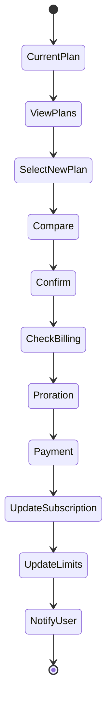

### 8.2 Payment Processing

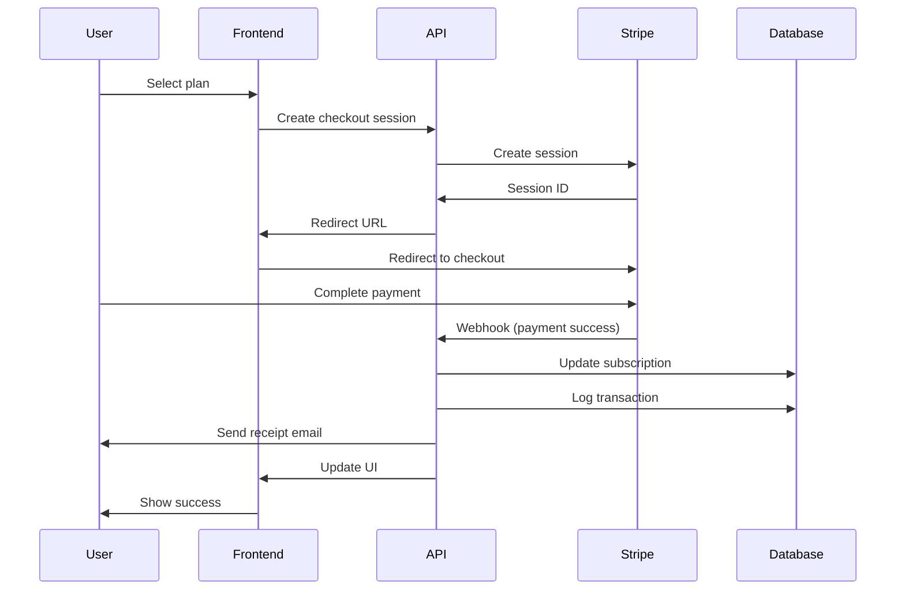

## 9. Security Workflows

### 9.1 Two-Factor Authentication Setup

```yaml
Setup Process:
  1. Navigate to Security Settings
  2. Click "Enable 2FA"
  3. Choose method:
     - Authenticator app (TOTP)
     - SMS (backup)
  4. Scan QR code or enter secret
  5. Enter verification code
  6. Save backup codes
  7. Confirm activation
  
Usage:
  - Login: Email + Password + 2FA code
  - Sensitive actions require 2FA:
    - Strategy deletion
    - API key generation
    - Withdrawal requests
    - Account changes
```

### 9.2 API Key Management

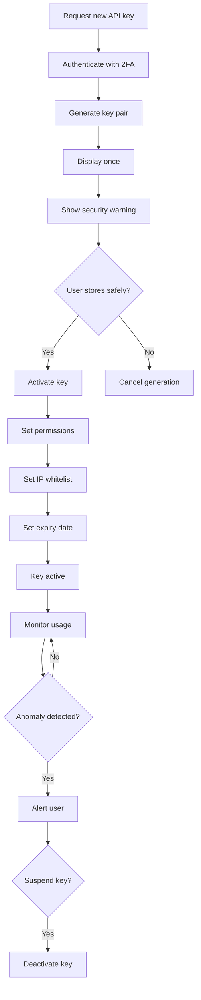

## 10. Customer Support Workflow

### 10.1 Issue Resolution

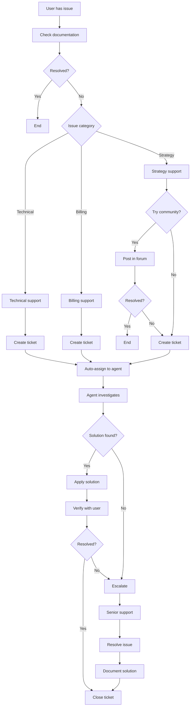

### 10.2 Feature Request

```yaml
Process:
  1. User submits request via:
     - In-app feedback form
     - Community forum
     - Support ticket
     
  2. Initial review:
     - Check if already exists
     - Check if planned
     - Assess feasibility
     
  3. Community voting:
     - Post to feature board
     - Allow user voting
     - Gather feedback
     
  4. Prioritization:
     - Technical complexity
     - Business value
     - User demand
     - Strategic fit
     
  5. Implementation:
     - Add to roadmap
     - Assign to sprint
     - Development
     - Testing
     - Beta release
     - Full rollout
     
  6. Communication:
     - Notify requester
     - Update changelog
     - Create tutorial
```

## Best Practices & Tips

### For New Users

1. **Start with Paper Trading**
   - Test strategies without real money
   - Understand platform features
   - Build confidence

2. **Use Conservative Settings Initially**
   - Small position sizes
   - Tight stop losses
   - Limited daily risk

3. **Monitor Actively at First**
   - Watch how strategies execute
   - Understand market behavior
   - Learn from each trade

### For Strategy Development

1. **Backtest Thoroughly**
   - Use multiple time periods
   - Include different market conditions
   - Account for transaction costs

2. **Diversify Strategies**
   - Don't rely on single strategy
   - Use different timeframes
   - Trade multiple instruments

3. **Regular Optimization**
   - Review performance monthly
   - Adjust to market changes
   - Remove underperforming strategies

### For Risk Management

1. **Set Appropriate Limits**
   - Never risk more than 2% per trade
   - Daily loss limit: 6% of account
   - Use correlation analysis

2. **Monitor Drawdowns**
   - Set maximum drawdown limits
   - Scale down during losses
   - Take breaks after losing streaks

3. **Keep Records**
   - Document all changes
   - Track performance metrics
   - Regular review sessions
